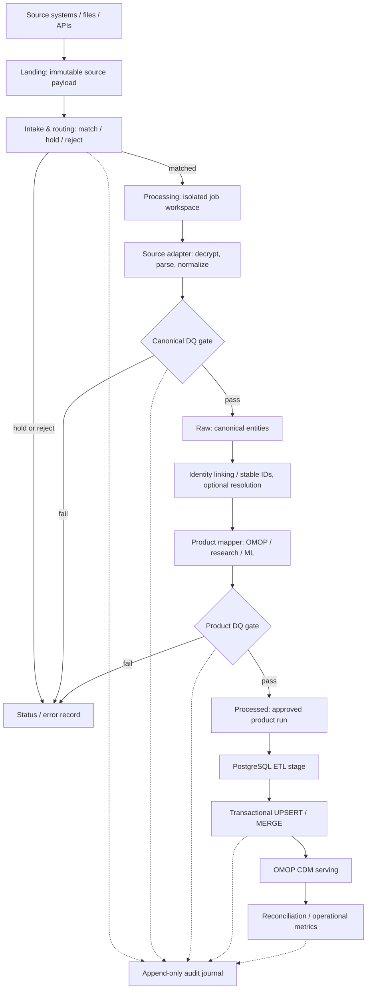

# Healthcare Data Platform — 数据处理架构与开发规范

> **文档状态：V1.0 — 开发基线（待按迁移计划实施）**  
> **制定日期：2026-10-07**  
> **适用范围：** Kubernetes + SeaweedFS（S3 API）+ Spark/PySpark + Airflow + PostgreSQL OMOP CDM；未来可映射到 OneLake / Microsoft Fabric。  
> **主要用途：** 统一目录、数据契约、作业边界、质量门禁、幂等、审计与编排规则，作为后续代码开发、PR 审查、运行手册和架构说明的共同依据。

## 0. 文档约定与设计边界

- 本文中的 **MUST / 必须** 表示新开发的强制约束；**SHOULD / 应当** 表示默认推荐，若偏离须在设计评审中说明。
- 所有 `s3://...` 均为**对象键设计示例**，并非断言对象已经存在。Spark 使用 `s3a://...` 访问同一对象存储。
- `2026-10-07`、示例 batch/run ID 仅用于说明；真实作业必须由接入/编排程序生成与校验，**不得写死日期、批次或 113 行**。
- 本文重点是**数据流与开发契约**，不是集群 Helm/Kubernetes 逐条部署手册。
- 所提及的零售文件名/品牌仅为**合成说明示例**，不依赖任何公司内部专有接口或实现。
- **已实现**与**目标设计**严格区分：当前 `person` 流程已跑通；以下新目录、新 processing 工作区、通用 Canonical Contract、审计等尚需迁移/开发。

## 1. 架构目标与不变原则

1. **接入与用途解耦。** Source Adapter 处理源系统差异；下游 OMOP Mapper 只依赖稳定的 Canonical Contract，不读取源系统特有文件布局。
2. **Landing 原样保留。** 进入 Landing 的源 payload 不被业务转换修改；新增 `manifest.json` 是平台控制元数据，不修改源文件。
3. **按批次追踪、按运行隔离。** `batch_id` 标识收到的逻辑数据批；`run_id` 标识一次 ETL 尝试。一个批次可以有多个重跑，不得相互覆盖中间结果。
4. **先验收后发布。** 解析、映射或 DQ 失败的数据进入隔离/待处理，不得被误认为已发布的 Canonical 或 Product 数据。
5. **可恢复且幂等。** 同一批次、相同输入重复运行，不生成新的业务身份或重复加载 CDM；重新处理使用新的 `run_id` 并留下记录。
6. **完整可追溯。** 最终记录可追溯到输入 batch、源对象 key/校验和、代码版本、mapping 版本、运行与质量结果。
7. **安全边界清晰。** 可能解密出的明文仅放受限的临时 Processing 工作区；不得出现在 Git、普通日志或公共分析产品中。
8. **目录不是数据质量/状态数据库。** 状态、批准版本、任务历史使用 manifest + 控制表/审计事件管理，不能只靠对象是否存在来判断成功。

## 2. 全链路与组件职责



| 组件/层 | 职责 | 不应承担的职责 |
|---|---|---|
| **Landing** (`health-landing`) | 接收、校验哈希、保留源文件和交付元数据 | 将 Epic/Synthea 强行改成统一字段 |
| **Intake / Routing** | 根据源注册表、接口版本、命名模式及 manifest 选择 Adapter；匹配/待处理/拒绝 | 用文件名猜测具体临床含义 |
| **Processing** (`health-processing`) | 每次运行独立工作目录；解密、解析、临时产物、拒绝记录、DQ 报告 | 作为永久的 Canonical 或最终产品区 |
| **Source Adapter** | 针对 Synthea/Epic/FHIR/HL7 等解析并映射到内部 Canonical Schema | 直接依赖 `cdm.person` 的最终表设计 |
| **Canonical DQ Gate** | 格式、Schema、必填、唯一性、引用与异常比例检查；放行/隔离 | 仅打印 PASS 而仍发布失败数据 |
| **Raw** (`health-raw`) | 保存**已通过门禁的 Canonical Parquet**，保留 lineage | 再保留源私有列名作为全局契约 |
| **Identity / Stable ID** | 稳定将源身份键映射到平台实体键；跨源合并身份为独立可选能力 | 把每次 Spark 行号当作稳定主键 |
| **Product Mapper** | Canonical → OMOP / research / analytics / ML 等用途转换 | 针对不同来源重新解析原始 CSV/HL7 |
| **Product DQ Gate** | 校验目标 Schema、术语 concept、关系、行数与产品约束 | 使用未经批准的输出供服务端读取 |
| **Processed** (`health-processed`) | 保存目标产品版本和每次成功运行的不可变数据快照/增量 | 用源系统作为顶层产品目录；把历史 run 全量一并读取 |
| **Serving** (PostgreSQL `etl` → `cdm`) | Stage、事务性 UPSERT、约束检查、查询服务 | 将 Spark `append` 直接当作幂等加载 |
| **Journal / Recon / OpIntel** | 审计事件、行数与校验和对账、指标、告警、运行状态 | 保存原始患者敏感明文或密码 |
| **Airflow** | 依赖、并行、重试、参数传递、任务状态和门禁执行 | 替代 Spark 进行大规模解析转换 |

**注意术语：** 本项目的 `health-raw` 是 **Canonical Raw（结构已标准化）**，不是未经处理的源文件；未经处理的原文属于 `health-landing`。

## 3. S3 Bucket 与物理目录规范（目标 V2）

### 3.1 Bucket 清单

| Bucket | 内容与保留策略 |
|---|---|
| `health-landing` | 已接收的源 payload + landing manifest；默认不可覆盖（逻辑不可变） |
| `health-processing` | **新增目标 Bucket**；运行级临时/隔离区，限制访问并设置生命周期清理策略 |
| `health-raw` | 已发布的 Canonical 实体数据，按 source batch 保存 |
| `health-processed` | OMOP 等数据产品的运行结果，按产品/版本/dataset/run 保存 |
| `health-archive` | 长期保存的审计事件、保留期到达后的归档、批准后的历史交付记录（具体生命周期另定） |
| `postgres-backup` | 数据库备份；**不属于业务数据的 ETL 层级** |

> 创建 `health-processing` 之前，先验证访问控制、空间、清理规则；**不得把当前已经跑通的旧路径直接删掉**。

### 3.2 Landing：固定接入外壳，自由 payload

```text
s3://health-landing/
└── source=<logical_source>/
    └── source_version=<interface_version>/
        └── ingest_date=<YYYY-MM-DD>/
            └── batch_id=<batch_id>/
                ├── manifest.json
                └── payload/
                    └── <source-provided relative paths and filenames>
```

**约束：**

- `source` 是**唯一的逻辑接入来源 ID**（必要时包含医院/接口实例），不能仅用 `epic` 这个厂商名混淆多家医院。例如 `epic_hospital_a_fhir` 和 `epic_hospital_b_fhir` 可以是两个 source。
- `source_version` 指**这条接口的数据契约/Schema 或规范版本**，不一定等于 Epic 产品发布版本。FHIR R4 与使用的 Implementation Guide/Profile 信息要明确记录在 manifest。
- `ingest_date` 是该批**首次接收日期（UTC 日期）**，不能被重跑日期替换。
- `batch_id` 是同一逻辑来源内可唯一识别的接收批次；**同一 batch_id、不同内容/哈希不可静默覆盖**。批次 ID 应避免路径分隔符与不安全字符。
- 只在 `payload/` 内保留源系统原始组织结构：Synthea 的 `csv/*.csv`、Epic 自定义 extract、FHIR Bundle JSON、HL7 `.hl7` 或 PGP 加密文件均可。
- 原始文件同名完全允许，只要完整对象 key 不冲突。真实重复投递用 manifest/校验和识别。
- `manifest.json` 由接入平台生成/补充，是**控制文件**；payload 保持原样。大型批次 manifest 可引用外部文件清单而非巨大的内嵌 JSON。

### 3.3 Processing：按源批次和运行分隔的隔离工作区

```text
s3://health-processing/
└── source=<logical_source>/
    └── source_version=<interface_version>/
        └── ingest_date=<YYYY-MM-DD>/
            └── batch_id=<batch_id>/
                └── entity=<canonical_entity>/
                    └── run_id=<safe_run_id>/
                        ├── job_request.json
                        ├── work/
                        │   ├── decrypted/       # 仅加密输入需要，严格限制/及时清理
                        │   ├── parsed/          # 临时解析结果（可选）
                        │   └── normalized/      # 待发布 Canonical 数据
                        ├── rejects/             # 错误记录或引用（避免泄露 PII）
                        ├── dq/
                        │   └── result.json
                        ├── next_stage_request.json  # 成功后下游任务请求（可选）
                        └── run_manifest.json
```

- Processing 中间产物是**运行级**，多个重试/回放使用不同 `run_id`；同一次 Spark task 的内部重试应避免写到其他运行目录。
- `job_request.json` 是**本次运行的输入请求/执行参数**，由路由/编排阶段写入；处理成功后的下游交接可以另写 `next_stage_request.json`。不要把二者混作同一个含义。
- `work/normalized/` 只有通过 DQ 后才能复制/发布到 Raw。Spark 临时文件的 `_SUCCESS` 仅说明某次写文件成功，**不等同 DQ PASS**。
- 对加密文件，解密产物必须改用正确的实际文件扩展名，例如 `.json.pgp` 解密后为 `.json`（如果解密内容确实为 JSON）。
- `decrypted/` 和 `rejects/` 应严格控制权限、保留期、日志输出；生产数据要求传输/静态加密并遵循机构合规要求。

### 3.4 Raw：统一 Canonical Schema、保留来源血缘

```text
s3://health-raw/
└── canonical_version=<version>/
    └── entity=<canonical_entity>/
        └── source=<logical_source>/
            └── source_version=<interface_version>/
                └── ingest_date=<YYYY-MM-DD>/
                    └── batch_id=<batch_id>/
                        ├── manifest.json
                        └── data/
                            ├── part-00000-....snappy.parquet
                            └── _SUCCESS
```

- **Entity 优先**：例如 `patient`、`encounter`、`condition`、`procedure`、`medication`、`observation`。名称必须由 Canonical Schema Registry 定义，不从源文件名直接推断。
- **Raw = Canonical**：相同 `canonical_version` + `entity` 的字段名、类型、业务含义、空值/编码规则必须一致，无论数据来自哪里。
- Source、版本、批次仍保留在路径和记录 lineage 中，不代表 Raw Schema 继续依赖源系统。
- 一个源文件可以拆到多个 Canonical Entity；多个源文件也可以合成为一个 Entity。不要假设文件到表是一对一。
- 业务主键至少包含**逻辑来源 + 源实体主键**的作用域；不同医院重复的 MRN、FHIR `Patient.id` 不应被误合并。
- `canonical_version` 只表达内部数据契约版本，独立于 `source_version` 和 OMOP 版本。
- **对象布局注意：** 读取 Parquet 只指向 `.../data/`；`manifest.json` 放在上一层，避免 Spark 在读取整个前缀时误扫控制文件。`_SUCCESS` 是 Spark 写在 `data/` 内的提交标记。
- 发布策略：优先写 Processing 临时前缀、校验并门禁 PASS 后再复制/发布到新的不可变 Raw batch 路径；不能在消费者可读的 Raw 路径上进行部分覆盖。

Canonical `patient` v1 的**示意字段**（真正字段清单与类型须单独登记和测试）：

```text
source_system, source_instance, source_record_id, source_batch_id,
birth_date, death_date, gender_code, race_code, ethnicity_code,
address_line, city, state, postal_code, latitude, longitude,
source_payload_ref, ingested_at, canonical_version, ...
```

> 此处仅是实体方向示例，不是已经批准的逐字段 Canonical schema。FHIR 的多 identifier、复杂 extension、编码 system 等可能需要子实体/扩展列；不得为实现简单 schema 而静默丢失必要信息。`person` 中名字/SSN 等敏感字段应单独评审访问范围、最小化与脱敏策略。

### 3.5 Processed：按产品/模型发布，不把 source 写死在顶层

```text
s3://health-processed/
└── product=<product_name>/
    └── product_version=<version>/
        └── dataset=<target_dataset>/
            └── processing_date=<YYYY-MM-DD>/
                └── run_id=<safe_run_id>/
                    ├── manifest.json
                    └── data/
                        ├── part-00000-....snappy.parquet
                        └── _SUCCESS
```

- `product=omop` 可包含 `dataset=person`、`visit_occurrence`、`condition_occurrence`、`drug_exposure`、`procedure_occurrence`、`measurement` 等。
- 以后还可有 `product=research`、`product=ml_features`、`product=analytics`；**Processed 不局限于 OMOP**。
- `product_version=5.4.3` 对 OMOP 指 **OMOP CDM 目标 Schema 版本**；Mapper/业务规则版本另记 `mapping_version`。
- `processing_date` 为作业运行的 UTC 日期；`run_id` 表示本次产品输出，可关联 Airflow DAG Run ID（必要时编码为路径安全字符串）。
- 一个 Processed run 可引用多个 source batch，输入清单必须写入 manifest；如果同时整合多个来源，**身份匹配策略必须明确**。
- 每个 `run_id` 目录原则上不可覆盖。**消费端不得递归读取所有历史 run 的 Parquet**，否则会重复数据；应通过已批准的 `published_run_id`/catalog 指针或数据库加载控制表选择输入。
- `manifest` 必须表明本次产物是 **snapshot** 还是 **incremental/change set**，以及下游适用的加载方式与水位线。不要默认每一个 run 都是一张完整表。

### 3.6 Archive 与 Journal 目录

```text
s3://health-archive/
└── journal/
    └── event_date=<YYYY-MM-DD>/
        └── run_id=<safe_run_id>/
            └── event_id=<unique_event_id>.json
```

每个审计事件只新增对象，不修改既有事件。对象存储的真正 WORM / Object Lock、版本化及法定保留能力需要**单独验证和配置**，不能因为目录名叫 `journal` 就声称具备物理不可篡改性。

## 4. 三种 ID、三个版本、两种时间

| 名称 | 定义 | 生成方/生命周期 | 典型用途 |
|---|---|---|---|
| `batch_id` | 来源交付的逻辑批次 ID | 接入平台/来源；重跑保持不变 | 去重、补数、输入定位 |
| `run_id` | 一次具体 ETL 执行/尝试的 ID | 编排平台；新尝试产生新值 | 工作目录、日志、重试、产品版本 |
| `source_record_id` | 来源内部记录标识 | 上游系统；与 source scope 组合使用 | 源记录关联与稳定键 |
| `source_version` | 上游接口/格式/契约版本 | 数据源注册表 | 选择 Adapter |
| `canonical_version` | 本平台统一实体 Schema 版本 | Canonical Contract | Source Adapter 输出、下游输入 |
| `product_version` | 目标数据产品 Schema 版本 | Product Contract，如 OMOP CDM 5.4.3 | 下游兼容性 |
| `ingest_date/time` | 平台首次接收到该批的时间 | Intake | 到达延迟、批次归档 |
| `event_time/date` | 业务记录实际发生时间 | 源数据，经过语义解析 | 业务窗口与事件分析 |
| `processing_time/date` | 本次流水线执行时间 | Airflow/作业运行 | run 追踪和运行指标 |

**主键与幂等：** `etl.person_id_map` 当前使用 `(source_system, source_person_id)` 唯一定位 Synthea person。多医院/多接口接入时，`source_system` 必须是足够唯一的**逻辑来源标识**，或扩展为 `(source_instance, source_person_id)` 等复合键。**稳定 ID 映射不等于跨系统同一患者识别**；跨源身份解析是独立的可选阶段，需明确匹配策略、质量阈值和人工复核机制。

## 5. Manifest / Job Request / DQ 的最小契约

以下为**建议的最小 v1 JSON 契约**；真正上线之前，应落地 JSON Schema、字段校验、示例数据与测试。时间统一使用带 `Z` 的 UTC ISO 8601。

### 5.1 Landing `manifest.json` 示例

```json
{
  "manifest_version": "1.0",
  "source": "synthea",
  "source_system": "synthea",
  "source_version": "v3.3.0",
  "batch_id": "synthea-20261005-pop100-atlanta",
  "ingested_at": "2026-10-07T20:00:00Z",
  "payload_format": "csv",
  "delivery_type": "batch",
  "source_parameters": {
    "seed": 20261005,
    "population": 100,
    "state": "Georgia",
    "city": "Atlanta"
  },
  "files": [
    {
      "path": "payload/csv/patients.csv",
      "entity_hint": "patient",
      "sha256": "<computed-sha256>",
      "size_bytes": "<computed-size-bytes>"
    },
    {
      "path": "payload/csv/encounters.csv",
      "entity_hint": "encounter",
      "sha256": "<computed-sha256>",
      "size_bytes": "<computed-size-bytes>"
    }
  ],
  "file_inventory_complete": false
}
```

> `file_inventory_complete=false` 表示这个 JSON 只展示了部分文件清单；正式接入必须记录**完整 18 个 CSV 等交付文件**（或引用不可变文件清单），不能把示例当作已校验的实际完整 manifest。真实 `sha256`、`size_bytes` 必须在上传时计算，**不得使用占位符**。示例日期仅说明结构。

### 5.2 Processing `job_request.json` 示例

```json
{
  "job_contract_version": "1.0",
  "run_id": "patient-20261007T201000Z-001",
  "batch_id": "synthea-20261005-pop100-atlanta",
  "source": "synthea",
  "entity": "patient",
  "adapter": "synthea_patient",
  "adapter_version": "v1",
  "canonical_version": "v1",
  "input_manifest_uri": "s3://health-landing/source=synthea/source_version=v3.3.0/ingest_date=2026-10-07/batch_id=synthea-20261005-pop100-atlanta/manifest.json",
  "input_payload_uri": "s3://health-landing/source=synthea/source_version=v3.3.0/ingest_date=2026-10-07/batch_id=synthea-20261005-pop100-atlanta/payload/csv/patients.csv",
  "requested_action": "normalize_and_validate",
  "requested_at": "2026-10-07T20:10:00Z"
}
```

**注意：** 这里的 URI 由 Intake 按 manifest 解析/生成；不能把固定日期和 Synthea 文件路径硬编码进可复用 DAG。

### 5.3 `dq/result.json` 示例

```json
{
  "run_id": "patient-20261007T201000Z-001",
  "entity": "patient",
  "gate": "canonical_admission",
  "status": "PASS",
  "checks": {
    "input_checksum": "PASS",
    "schema": "PASS",
    "required_fields": "PASS",
    "primary_key_uniqueness": "PASS",
    "type_cast": "PASS"
  },
  "input_rows": 113,
  "accepted_rows": 113,
  "rejected_rows": 0,
  "checked_at": "2026-10-07T20:13:00Z"
}
```

真实检查项与严重级别须由 Entity/Product Contract 指定。例如不存在的 concept、错误的 patient 外键为阻断项；其他低风险异常可采用经批准阈值的 `WARN`，不能静默跳过。

### 5.4 Processed `manifest.json` 示例

```json
{
  "manifest_version": "1.0",
  "product": "omop",
  "product_version": "5.4.3",
  "dataset": "person",
  "run_id": "person-20261007T202000Z-001",
  "processing_date": "2026-10-07",
  "canonical_version": "v1",
  "mapping_version": "person-map-v1",
  "load_semantics": "incremental_upsert",
  "inputs": [
    {
      "source": "synthea",
      "batch_id": "synthea-20261005-pop100-atlanta",
      "entity": "patient",
      "raw_manifest_uri": "s3://health-raw/canonical_version=v1/entity=patient/source=synthea/source_version=v3.3.0/ingest_date=2026-10-07/batch_id=synthea-20261005-pop100-atlanta/manifest.json"
    }
  ],
  "output_rows": 113,
  "dq_status": "PASS",
  "status": "APPROVED",
  "code_revision": "<git-commit-sha>"
}
```

`APPROVED` 是经 Product Gate 和发布控制确认后的状态，**不是只要 Spark 写出 `_SUCCESS` 就自动批准**。上线时 `code_revision` 必须是真实 Git commit。

## 6. 路由、失败状态、质量门禁和发布协议

### 6.1 Intake 路由状态

| 状态 | 触发条件示例 | 处理方式 |
|---|---|---|
| `MATCHED` | 来源、接口版本、payload 类型与已注册 Adapter 匹配 | 创建 job_request，进入 Processing |
| `ON_HOLD` | 未支持的接口版本、缺少交付清单、等待授权/人工判定 | 保留原文件，阻止进入 Raw；补配置后重试 |
| `REJECTED` / `ERROR` | 校验和错误、损坏文件、恶意/不允许内容、必需元数据冲突 | 隔离、写错误事件，不能静默改写源文件 |

命名/正则表达式只是路由依据之一；**不能仅依赖正则匹配文件名确认内容合规**。必须结合来源注册表、manifest、实际解析和 Schema 校验。

### 6.2 两级 Quality Gate

1. **Canonical Gate**：Processing → Raw 前，检查源契约、解析、字段类型、必填、源主键重复、引用完整性、拒绝量/比例。失败则 Raw **不发布**。
2. **Product Gate**：Canonical → Processed/Serving 前，检查 OMOP 字段类型、必填、标准术语 concept、稳定 ID、业务域/关系映射、重复键、输出行数与 recon。失败则 Processed **不批准、Serving 不加载**。

**最小发布协议：**

```text
create isolated run → write temporary output → validate DQ
→ finalize data prefix and manifest → register approved run
→ allow downstream consume → append audit event
```

需要明确无原子重命名的 S3 存储语义：对象批量复制不天然原子。发布时以**先完成内容、后登记批准 run**作为读者可见性边界；下游必须只消费登记为批准的运行，而不是对 bucket 递归扫描。

### 6.3 幂等与恢复规则

- 同一个 `(source, batch_id, payload checksum)` 再投递应识别为重复；同 key 不同 checksum 必须报冲突或生成新批次，不能覆盖。
- 每次重新执行都创建新的 `run_id`，并引用相同的 `batch_id`；同一批下历史运行可查。
- Raw batch 输出确定性/逻辑唯一；再次发布必须先比对内容与元数据。不能覆盖一个已获批准的不同结果。
- `etl.person_id_map` / `etl.visit_occurrence_id_map` 类表必须使用稳定、带来源作用域的唯一键；禁止 `row_number()` 为重新运行的数据随机换主键。
- Spark JDBC → **独立 Stage** → PostgreSQL 事务 UPSERT；禁止直接盲目 append 目标 CDM。
- Stage 必须按批/运行隔离或串行清空使用；当前单表 `TRUNCATE etl.person_stage` **仅适用于串行 Lab**，有并发 DAG 时必须切换为 `run_id`-scoped stage/锁机制，避免并发互相清空。
- `snapshot` 与 `incremental` 产物的 recon 与回滚方式不同，必须在 manifest 中声明，不得简单把某个 run 的行数当成全表最终总数。

## 7. 稳定身份与可选 Entity Resolution

当前单来源已实现：

```text
Synthea patient UUID
       ↓ etl.person_id_map
integer cdm.person.person_id
```

目标扩展（不能简单混为一谈）：

```text
source-scoped patient keys (Epic MRN, FHIR Patient.id, Synthea UUID)
       ↓ stable source identity mapping
source-specific person identity
       ↓ optional, governed identity resolution
enterprise person identity
       ↓ OMOP mapping
cdm.person.person_id
```

- Source Adapter 的职责是**准确解释源标识和编码**；跨源患者去重/合并是单独受管控流程。
- 不允许把相同 MRN 数值当成全球同一患者；要考虑 assigning authority、医院实例、标识系统、有效期与变更。
- 可选 Identity Resolution 未启用时，下游只按当前明确的来源作用域键关联，不进行未经授权的患者合并。

## 8. 文件流转完整示例 A：Synthea CSV → OMOP `cdm.person`

> **示例目标路径：V2 设计。** 当前集群上已经跑通的 `person` 113 行流程仍使用旧 S3 key；本示例描述**迁移后应该如何流转**，不是当前对象已经在 V2 路径存在。

### 8.1 收到整个 Synthea batch（Landing）

```text
s3://health-landing/
└── source=synthea/
    └── source_version=v3.3.0/
        └── ingest_date=2026-10-07/
            └── batch_id=synthea-20261005-pop100-atlanta/
                ├── manifest.json
                └── payload/
                    ├── csv/
                    │   ├── patients.csv           # 113 行
                    │   ├── encounters.csv         # 5,799 行
                    │   ├── conditions.csv         # 4,152 行
                    │   ├── medications.csv        # 5,467 行
                    │   ├── procedures.csv         # 16,994 行
                    │   ├── observations.csv       # 76,588 行
                    │   └── ... (其他 CSV)
                    └── SOURCE_INFO.txt
```

完整 payload 结构由 Synthea 导出和交付包决定，不能拿 `patients/`、`encounters/` 当作所有系统必须遵守的目录。`manifest` 列出实际 18 个 CSV 文件与 checksum。

### 8.2 Intake/Processing 对 `patient` 的运行

```text
s3://health-processing/
└── source=synthea/source_version=v3.3.0/
    ingest_date=2026-10-07/
    batch_id=synthea-20261005-pop100-atlanta/
    entity=patient/
    run_id=patient-20261007T201000Z-001/
    ├── job_request.json
    ├── work/
    │   └── normalized/
    │       └── data/part-00000-....parquet      # 尚未发布
    ├── dq/result.json                         # 113 accepted, 0 rejected, PASS
    ├── rejects/                               # 无拒绝记录时可为空或不存在
    ├── next_stage_request.json                # 可选
    └── run_manifest.json
```

处理程序：**Synthea-specific `synthea_patient_adapter`**，负责字段标准化/类型转换，并生成 `Canonical patient v1`，不负责写 `cdm.person`。当前同类能力来自 `apps/ingest-patients-raw.py`，重构时需要改为正式 Canonical Contract。

### 8.3 Gate PASS 后，发布 Canonical Raw

```text
s3://health-raw/
└── canonical_version=v1/
    └── entity=patient/
        └── source=synthea/source_version=v3.3.0/
            ingest_date=2026-10-07/
            batch_id=synthea-20261005-pop100-atlanta/
            ├── manifest.json                   # adapter 版本 / lineage / DQ / 113 行
            └── data/
                ├── part-00000-....snappy.parquet
                └── _SUCCESS
```

**这时**可以从不同 Source 获得统一的 `patient` 字段语义；不过 source lineage 仍在路径/列中。读取时使用 `.../data/`，不包含 manifest。

### 8.4 Canonical → OMOP 产品映射

```text
Canonical patient Parquet
    + stable source key → etl.person_id_map
    + gender/race/ethnicity → OMOP vocabulary concept
    ↓ OMOP person mapper
s3://health-processed/
└── product=omop/product_version=5.4.3/
    dataset=person/processing_date=2026-10-07/
    run_id=person-20261007T202000Z-001/
    ├── manifest.json                       # 113 行, mapping version, input batches
    └── data/
        ├── part-00000-....snappy.parquet  # 18 个 OMOP person 字段
        └── _SUCCESS
```

当前已有相近代码 `apps/map-person-omop.py`，但它的映射值仍部分写死在 Python 中；**V2 应读取版本化 Mapping Contract**，并让 Mapper 只依赖 canonical 字段。

### 8.5 Processed → Stage → OMOP CDM

```text
health-processed/.../dataset=person/.../data/*.parquet
    ↓ PySpark JDBC loader
PostgreSQL etl.person_stage                   # run 隔离待增强
    ↓ SQL transaction / UPSERT
PostgreSQL cdm.person
    ↓ row count / FK concepts / stage comparison
Operational reconciliation + append-only journal
```

**现有实验已验收结果：** 113 名源患者 → 113 条 `cdm.person`，唯一 person ID 113，概念校验 0 异常，Stage/CDM 差异 0；重复执行后行数仍为 113。此验收对应**旧路径上的现有实现**，不是 V2 迁移验收。

### 8.6 从 Patient 扩展到其他业务实体

```text
CSV / FHIR / HL7 source payload
      ↓ adapter (source-specific)
Canonical patient / encounter / condition / procedure / medication / observation
      ↓ product mapping (source-agnostic, domain-specific)
OMOP person / visit_occurrence / condition_occurrence /
     procedure_occurrence / drug_exposure / measurement / observation
```

**注意非一对一：** 一个源文件可分流至多个 Canonical/OMOP 表（如 observations 到 `measurement` 或 `observation`）；一张 OMOP 表也可能汇集多个源文件/来源。不能以原始 CSV 文件个数决定 Spark Job 或 OMOP 表的数量。

## 9. 文件流转完整示例 B：类似 Walmart 的加密零售交易文件

> **纯假设的跨行业例子**，仅演示通用平台的目录/操作语义，不表示任何真实公司内部平台必须如此实现。`retail-*` bucket 是例子，不要求本 healthcare Lab 实际创建。

### 9.1 Source 原始交付与 Landing

源文件名：

```text
walmart_tx_20261007_east01.json.pgp
```

目标 Landing：

```text
s3://retail-landing/
└── source=walmart_store_pos/
    └── source_version=v1/
        └── ingest_date=2026-10-07/
            └── batch_id=wm-east01-20261007-001/
                ├── manifest.json
                └── payload/
                    └── Store_pos/
                        └── walmart_tx_20261007_east01.json.pgp
```

此时 `.json.pgp` **仍然加密**、字节不变；manifest 记录文件名、哈希、文件格式、加密方式、交付批次。平台用源注册信息和 manifest 判断该文件属于 `retail_transaction` Adapter；不能只凭文件名后缀判断安全与真实性。

### 9.2 Routing + Data Preparation + Gate

```text
s3://retail-processing/
└── source=walmart_store_pos/source_version=v1/
    ingest_date=2026-10-07/batch_id=wm-east01-20261007-001/
    entity=retail_transaction/run_id=retail-20261007T220000Z-001/
    ├── job_request.json
    ├── work/
    │   ├── decrypted/
    │   │   └── walmart_tx_20261007_east01.json
    │   └── normalized/
    │       └── data/part-00000-....snappy.parquet
    ├── dq/result.json
    ├── rejects/
    ├── next_stage_request.json
    └── run_manifest.json
```

数据变化：

```text
Landing: encrypted .json.pgp (原样)
  ↓ decrypt (受限临时空间)
Processing: plaintext .json
  ↓ parse / validate schema / normalize fields and types
Processing: canonical retail_transaction Parquet
  ↓ DQ PASS / approved publish
Raw: canonical retail_transaction Parquet
```

如果解密失败、Schema 未注册或 DQ 阻断，则保留 Landing、写错误/hold 事件，不向正式 Raw 发布。解密明文必须按策略清理，日志不得包含交易敏感数据。

### 9.3 Canonical Raw → 产品 → 数据服务

```text
s3://retail-raw/
└── canonical_version=v1/entity=retail_transaction/
    source=walmart_store_pos/source_version=v1/
    ingest_date=2026-10-07/batch_id=wm-east01-20261007-001/
    ├── manifest.json
    └── data/part-00000-....snappy.parquet

         ↓ product-specific transformation

s3://retail-processed/
└── product=retail_analytics/product_version=v1/
    dataset=retail_transactions/processing_date=2026-10-07/
    run_id=retail-product-20261007T221500Z-001/
    ├── manifest.json
    └── data/part-00000-....snappy.parquet

         ↓ controlled stage + MERGE

Warehouse / Retail transaction serving tables
         ↓
Reconciliation, metrics, journal
```

**对应关系的本质：** 目录外壳可复用，Synthea CSV 与零售 PGP JSON 的解析 Adapter 不同；Canonical Schema 不同；OMOP 与 retail analytics 的 Product Mapper 不同；**编排、运行标识、门禁、幂等、审计、文件生命周期机制可复用**。

## 10. Airflow、Spark 和 PostgreSQL 的任务分工

### 10.1 建议 DAG 边界（按 batch 参数化）

```text
register_and_verify_batch
   ↓
route_source_and_create_job_request
   ↓
submit_source_adapter_spark_application
   ↓
canonical_dq_gate
   ├─ FAIL → quarantine / hold / audit → STOP
   └─ PASS
        ↓
publish_canonical_raw
   ↓
prepare_or_lookup_stable_ids
   ↓
submit_product_mapper_spark_application
   ↓
product_dq_gate
   ├─ FAIL → reject_product / audit → STOP
   └─ PASS
        ↓
approve_product_run
   ↓
load_postgres_stage
   ↓
transactional_upsert_cdm
   ↓
reconcile_and_journal
   ↓
mark_batch_product_complete
```

- Airflow **传入** `source`、`source_version`、`ingest_date`、`batch_id`、`run_id`、manifest URI、合同版本；不在 DAG 里逐个写死文件名。
- SparkApplication 负责重计算和 JDBC data movement；Airflow 不直接处理整批 DataFrame。
- PostgreSQL 负责 `INSERT ... ON CONFLICT DO UPDATE` / `MERGE`、约束与事务边界；写入前用 run-scoped stage 或串行锁。
- `person` 成功并准备稳定映射后，`visit_occurrence` 才能引用稳定 person ID；condition/procedure/drug 等按 person/visit 依赖执行，互不依赖的 domain 可以并行。
- 与 Dag Run 对应的 `run_id` 必须在所有 Spark job、Processing、Raw/Processed manifest、审计事件中可关联；数据产品的发布 ID 不要求等于 Airflow 的技术 task attempt ID。

### 10.2 开发代码结构建议（目标，非现状）

```text
spark/
├── common/
│   ├── s3_io.py
│   ├── jdbc_io.py
│   ├── contracts.py
│   ├── dq_gates.py
│   ├── manifest.py
│   ├── id_mapping.py
│   └── audit.py
├── adapters/
│   ├── synthea/
│   │   ├── patient.py
│   │   └── encounter.py
│   ├── epic_fhir/
│   └── hl7v2/
├── products/
│   └── omop/
│       ├── person.py
│       ├── visit_occurrence.py
│       └── condition_occurrence.py
└── contracts/
    ├── canonical/
    ├── products/
    └── mappings/

airflow/dags/
├── healthcare_ingestion.py
└── healthcare_omop.py

sql/
├── etl_control/
├── omop_staging/
└── upsert/
```

使用 source-specific Adapter + domain-specific Mapper；公用代码负责 I/O、运行上下文、DQ、审计、JDBC 与幂等发布。**不应为每个 CSV 复制五份互相独立的公共逻辑**。

## 11. 审计、Reconciliation 与运维指标

### 11.1 最小审计事件

每一个关键状态变化至少要记录：

```text
run_id, batch_id, source, entity/product/dataset,
event_type, event_time_utc, status, input_manifest_uri,
output_manifest_uri, row_counts, reject_counts,
dq_status, adapter_version, mapping_version, code_revision,
error_class, correlation_id
```

推荐事件：`BATCH_RECEIVED`、`ROUTE_MATCHED`、`ROUTE_ON_HOLD`、`NORMALIZATION_STARTED`、`CANONICAL_DQ_PASSED`、`RAW_PUBLISHED`、`PRODUCT_DQ_PASSED`、`PRODUCT_APPROVED`、`CDM_LOAD_COMMITTED`、`RECON_PASSED`、`RUN_FAILED`。审计事件 append-only；可变最新状态可另存在 PostgreSQL `etl.pipeline_run` 等控制表中。

### 11.2 最小 Recon

- 输入文件数、对象 checksum、源记录总数（可确定时）。
- Canonical 接受/拒绝/隔离记录数；数据拆分或聚合时记录明确公式，而不是假设 input=output。
- Processed dataset 输出数、唯一键数、缺失主键/概念数。
- Stage 行数、UPSERT 插入/更新计数（如果能够可靠区分）、CDM 本批次有效记录数。
- Source ID ↔ OMOP ID 匹配成功率，Person/Visit 外键完整性。
- 运行时长、重试次数、失败阶段、数据新鲜度和延迟。

**示例（`person`，现有单批次）：** `113 Landing → 113 Canonical → 113 Processed → 113 Stage → 113 CDM`，reject=0，stage/CDM diff=0。但其他域存在一对多/拆分/过滤时，不得机械要求行数完全相等，应使用各 domain 的 recon 规则。

## 12. 安全、保留与操作约束

1. 各层独立访问权限：Landing 接入、Processing 解密、Canonical 使用者、Product 发布者、数据库写入者应尽可能分离。
2. 密钥/数据库密码只来自 Kubernetes Secret 或受管 Secret 系统；不写进 manifest、DAG、SQL 文件、Git、日志。
3. PGP 解密后的明文是高敏中间数据；仅在受限区域短期保留，处理完成/失败都按策略清理，并记录清理状态。
4. 真实患者数据必须按适用合规要求进行访问、脱敏、加密、审计及保留管理；本地 Synthea 为合成数据也要演练安全控制。
5. `health-processing` 可按运行状态+保留策略清理；Landing、Raw、Processed、Journal 的保留与归档是**分别配置的策略**，不要用统一自动删除。
6. 当前本地 SeaweedFS S3 endpoint 为集群内 HTTP 测试环境。未来涉及真实数据或跨不可信网络时应启用 TLS、网络隔离、最小权限及合适的加密/密钥管理。
7. 文件路径、manifest 与日志不得随意写患者姓名、SSN、MRN 等直接标识；仅用不包含敏感信息的批次和运行标识。

## 13. 已实现状态、差距与 V2 迁移顺序

### 13.1 截至本次讨论的已验证能力

| 功能 | 当前状态 |
|---|---|
| Synthea v3.3.0 CSV 生成、校验（18 个 CSV） | ✅ 已实现 |
| SeaweedFS `health-landing` 上传及 SHA256 校验 | ✅ 已实现（**旧 key**） |
| PySpark patients CSV → typed Raw Parquet + DQ | ✅ 已实现（**当前仅 Synthea 适配**） |
| 稳定 `etl.person_id_map` | ✅ 已实现（113 个 source ID） |
| PySpark Raw → OMOP-ready `person` Parquet + DQ | ✅ 已实现（**旧 key + 部分硬编码 mapping**） |
| Spark JDBC → `etl.person_stage` → PostgreSQL `cdm.person` | ✅ 已实现 |
| `cdm.person` 113 行、重复执行幂等、概念与差异校验 | ✅ 已验证 |
| 通用 Landing/Raw/Processed V2 key + manifests | ⏳ 目标设计，**尚未迁移** |
| 新增 `health-processing` bucket 与 run 工作区 | ⏳ 目标设计，**尚未创建/验证** |
| 正式 Canonical v1 schema registry、通用 Source Adapter | ⏳ 待设计/实现 |
| 批次/运行路由、DQ 发布控制、Journal、Recon 控制表 | ⏳ 待实现 |
| 全流程 Airflow healthcare DAG | ⏳ 尚未把现有手工脚本正式串联 |
| `visit_occurrence` 等其他临床 domain | ⏳ 后续开发 |

### 13.2 推荐重构顺序（严禁直接删旧数据）

**阶段 A：契约优先**

1. 确定 `source` 来源注册表、命名规则、batch/run ID 生成规则和路径解析工具。
2. 固化 Canonical `patient` v1 字段、类型、可空/编码规则及 JSON Schema/数据质量断言；明确当前 Raw 与真正通用 Canonical 的差异。
3. 固化 3 类 manifest、`job_request.json`、DQ result 的 Schema 与验证程序。
4. 在新路径上建立一个测试批次。旧路径、旧代码暂留可回滚。

**阶段 B：Person V2 端到端迁移**

5. 配置 `health-processing` bucket、ACL、生命周期与独立 `run_id` 目录。
6. 调整当前 `03` 上传逻辑，生成 Landing V2 manifest 与 `payload/`；校验上传前后哈希一致。
7. 将当前 `04/05` 拆分为 Synthea patient Adapter + Canonical Gate + Raw 发布；Raw 仅发布 PASS 批次。
8. 将当前 `10/11` 改成从 Canonical Contract 读取，配置化人口学 mapping；写 Processed V2、验证并批准 run。
9. `12` 的 JDBC/SQL 继续复用已经证明有效的 Stage→UPSERT 模式，改为 run-scoped stage/安全锁，并使用 manifest 动态计数与批次级对账。
10. 新旧两条流程对照：113 个稳定 person_id、OMOP 行内容、概念映射、Source lineage 相符。**先验收再切换消费者**。

**阶段 C：平台化与扩展**

11. 加入不可变事件日志、控制表、Recon/运行指标、failure/hold/replay 测试。
12. 用 Airflow 按 batch/run 参数化串联上述作业，明确重试、批准发布和失败停止条件。
13. 完成 `encounter → visit_occurrence`；Person + Visit 均稳定后提炼公共 Source Adapter / Product Mapper / DQ / JDBC 模块。
14. 再扩展 condition、procedure、drug、observation，并用第二种输入（FHIR/HL7/Epic-style 合成样例）证明 Source 与 OMOP 解耦。
15. 只有当新路径完成验收、消费者已切换、保留策略批准后，才规划旧 smoke-test 和旧 batch 对象的归档/清理。

### 13.3 V2 最小验收清单

- [ ] 两个不同 source、相同 `patients.csv` 文件名不会发生覆盖。
- [ ] 同 source、同 batch、相同 checksum 重投递被识别为重复；不同 checksum 拒绝覆盖。
- [ ] 不支持的 Schema 版本进入 `ON_HOLD`，不产生 Raw 发布。
- [ ] 错误文件 checksum / Schema / 主键缺失触发 DQ FAIL，Processed/CDM 不被更新。
- [ ] Processing 每次运行具有不同 `run_id`；失败后可回放，原输入及历史审计可追踪。
- [ ] Raw `entity=patient` 跨不同 Source 保证 Canonical 字段语义一致。
- [ ] Consumer 仅读取已批准的 `data/` 前缀，不误读 manifest 或历史 run。
- [ ] OMOP mapper 使用稳定身份映射、版本化 concept mapping；不硬编码 Synthea 路径。
- [ ] `person` V2 在与现有测试数据等价的输入下输出 113 条有效记录，Source ID ↔ person ID 不变化。
- [ ] JDBC Stage / SQL UPSERT 重跑不增加重复的 `cdm.person` 行；Stage 与 CDM 差异为 0。
- [ ] 全链路可按 `source + batch_id + run_id` 追溯并查询 DQ/Recon 状态。
- [ ] 在并行任务情况下，两个 run 不会互相清空同一 Stage 或覆盖 Product 输出。

## 14. 最终开发约束（PR 审查条款）

1. **新增来源**：只允许通过新 Adapter/源契约扩展；禁止为了 Epic 改掉已有 Canonical Patient 的字段语义。
2. **新增 OMOP 域**：优先复用公共 I/O、Run Context、DQ、Stage/UPSERT、Journal；只写 domain-specific mapping 和校验规则。
3. **禁止硬编码**：真实 `batch_id`、`run_id`、输入 S3 key、行数、Secret、日期必须参数化；demo fixture 可以在测试中显式固定。
4. **Schema 变更**：改变列语义/类型须评估 `canonical_version` 升级与旧版读取兼容性；改变 OMOP target version 需单独发布迁移。
5. **输出发布**：每次新 run 独立前缀，先校验后批准；消费者只使用批准 run，不能扫描所有历史 run。
6. **不可变与补数**：不覆盖原始 Landing payload、已发布批次和 Journal 事件；修复使用新 batch 或新 run，并保留关联链。
7. **可复现**：代码、配置、Mapping Contract 进 Git；源合成数据可以再生成，密钥、加密明文、真实敏感数据绝不进 Git。
8. **已验证的旧实现**：重构前保留可工作的脚本和旧对象，并记录迁移差异；不允许未经验证直接以 V2 替换现有生产/实验消费者。

---

### 一句话总结

**统一接入外壳与批次契约 → 运行级 Processing 隔离 → Source Adapter → DQ Gate → Canonical Raw → 可选身份关联 → Product Mapper → Product Gate → Processed → Stage/UPSERT → CDM/Serving；Airflow 负责串联与恢复，Audit/Recon 贯穿整个流程。**

> **后续代码开发默认以本规范的 V2 目标目录和职责边界为依据；若发现冲突，先更新架构决策和契约，再修改实现。**
