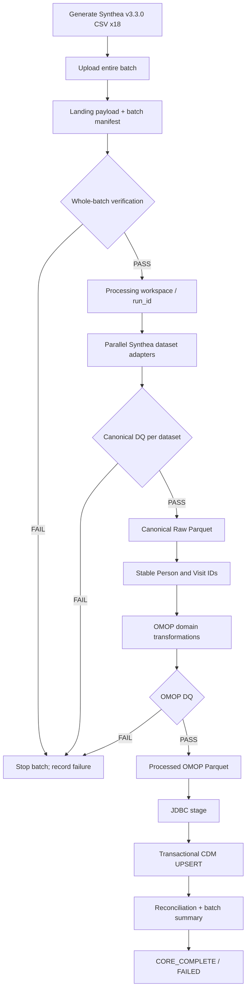
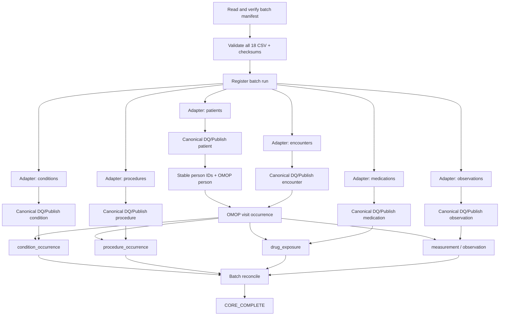
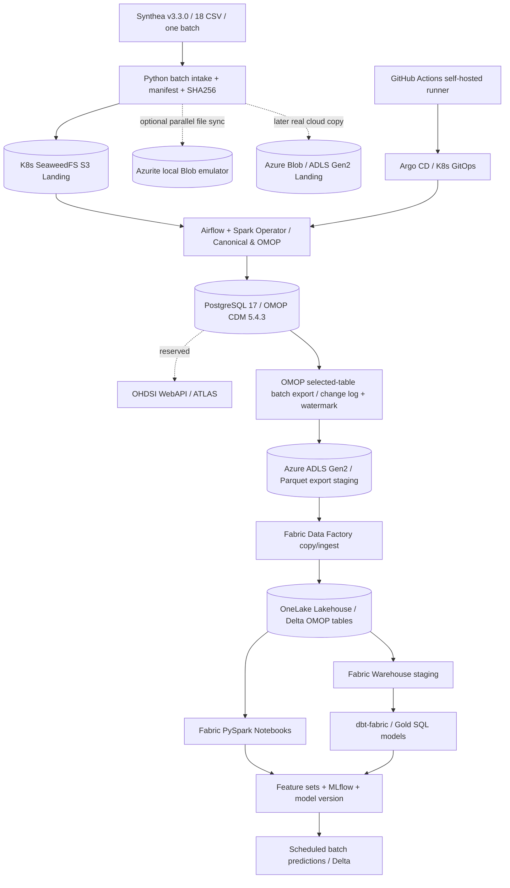

# Healthcare Data Platform — Synthea Batch ETL + Azure/Fabric/ML 混合架构与开发基线

> **文档版本：V2.1（Batch-first Hybrid Roadmap）**  
> **更新日期：2026-10-08**  
> **状态：正式目标设计；本地 Person 旧版已验证，Batch V2 / Azure / Fabric / ML 部分尚待独立验收**  
> **项目仓库：** `JohnZhang-DataForge/healthcare-data-platform`  
> **适用环境：** 本地 Kubernetes + SeaweedFS（S3 API）+ Spark Operator/PySpark + Airflow + PostgreSQL 17 / OMOP CDM 5.4.3；新增 Azure Blob/ADLS Gen2、Microsoft Fabric OneLake/Lakehouse/Warehouse、dbt-fabric、MLflow、GitHub Actions Runner、Argo CD 的分阶段目标
>
> **优先主目标（阶段 I）：** 用 **Synthea v3.3.0 一次生成的整批 18 个 CSV**，建设、验证并自动编排可重复运行的 **Batch → Canonical → OMOP CDM**。**第二目标（阶段 II）：** 同一合成批次验证 S3 + Azure Blob 双落地，并将已经落库的选定 OMOP 表按批/增量复制到 OneLake Delta，完成 Fabric Notebook + dbt-fabric + MLflow 的批处理分析与预测闭环。阶段 II **不得阻塞阶段 I、TASK-001**。FHIR/HL7/Mirth 是后续单独扩展目标，不属于当前 Synthea 开发批次。

---

## 0. 决策摘要（后续开发以本节为准）

1. **一个交付批次（batch）包含多个文件。** 同一次 Synthea 导出产生的 18 个 CSV 属于同一个 `batch_id`。平台先完整接收、登记、校验整个批次，再对具体数据集分配任务，不能把 `patients.csv` 当成整个批次。
2. **整个批次的所有文件都要有处理结论；不要求每个 CSV 对应一个 OMOP 表。** 本轮对 18 个文件做清单、完整性、格式和基础质量检查。优先转换主要临床实体；其余文件明确记录为 `DEFERRED`（本阶段暂不映射），绝不能把“核心表处理完成”描述为“18 个文件全部完成 OMOP 映射”。
3. **先完成 Synthea CSV 批处理，再接 Azure/Fabric。** 阶段 I 不实现 HL7/FHIR/Mirth、流式处理、MPI 等；阶段 II 扩展 Azure Blob/ADLS Gen2 双目标落地和经 OMOP 验收后的 Fabric 分析/ML。Azure 不作为本地批次成功的前置条件；新增工作分独立任务逐步验收。
4. **文件目录先统一，再继续增加业务表。** 采用 `Landing → Processing（临时）→ Canonical Raw → OMOP Processed → Stage → CDM`。旧 S3 key 和既有 `person` 数据先保留；迁移验收前不删除。
5. **Source Adapter 与 OMOP Mapper 解耦。** Synthea Adapter 只负责读取源 CSV 并生成我们定义的 Canonical 实体；OMOP Mapper 只读 Canonical 数据和稳定 ID/概念映射，不依赖源 CSV 文件名与字段名。
6. **Airflow 按 `batch_id` 统筹整批执行。** 一个 batch 触发一个批处理 DAG Run；Raw 作业可以并行，OMOP 作业按 `person → visit → 临床事实表` 的依赖执行；最后给出清晰的批次状态与对账结果。
7. **先交付可演示的闭环。** 基础文件清单、DQ、幂等、失败停止与批次汇总是必须项；复杂路由、不可篡改账本、MPI、通用 UI 暂不做。云端 Fabric、ML 和 GitOps 是后续有独立验收的增强路径，不能用“设计存在”代替“已实施”。

### 0.1 阶段 I：本地 Batch MVP 怎样才算完成

**Batch MVP 完成（`CORE_COMPLETE`）：**

- 18 个输入 CSV 都已登记、传入 Landing、校验 checksum/header/基本质量，并获得明确处理状态。
- 核心数据从 **同一个 batch** 转换成 Canonical Parquet，再生成并加载 `cdm.person`、`cdm.visit_occurrence`、`cdm.condition_occurrence`、`cdm.procedure_occurrence`、`cdm.drug_exposure`，以及由 `observations.csv` 派生的 `cdm.measurement` 和适用的 `cdm.observation`。
- 所有加载都有 DQ 与批次对账、stable ID/FK 检查、失败阻断与重跑验证。
- Airflow 可以从一个 batch manifest 启动整个流程，并完成状态汇总。
- 其余文件（如 claims/payers 等）没有被默默丢弃，必须在清单中标明 `DEFERRED` 与理由。**`CORE_COMPLETE` 不等于全部 Synthea 18 个数据集都做了完整 OMOP ETL。**

> 若将来为全部适用文件补齐 OMOP 处理，再定义更严格的 `FULL_COMPLETE`；本次交付**不以此为目标**。

### 0.2 V2.1 设计变更摘要与状态口径

- 这次是**在 V2 Batch 基线之上扩展**，不是将 Synthea 主流程改成云端优先，也不是把 Fabric 装在本地 S3 上。
- **本地对象存储**是 SeaweedFS（S3 协议）；**本地第二目标**可运行 Azurite（Azure Blob API 模拟器）；**真正云端落地**使用 Azure Blob 或开启 HNS 的 ADLS Gen2 Storage Account；**Fabric** 是读取/复制云数据、创建 OneLake/Lakehouse/Warehouse、运行 Notebook/MLflow 的独立托管平台。彼此不可混作同一个组件。
- **本地 CDM 先完成**：PostgreSQL OMOP 5.4.3 是事实主库和 OHDSI/ATLAS 的预留数据源；Fabric Delta 是其选定表的分析副本，不反向覆盖 CDM。
- **两条流的职责不同**：① 合成文件双落地（S3+Azure Blob）证明多存储目标同步；② OMOP 表按批次导出到 Azure/OneLake，证明 Fabric Analytics/ML。不能把双目标原始文件同步说成数据库已经复制。
- **简历文字是目标能力清单，不是实施证据**。新会话或 Codex 只能在存在真实执行日志、PR、验收记录时把某个组件从 `PLANNED` 改为 `VERIFIED`。
- 当前 Codex `TASK-001` 的权威范围保持不变：**只做本地 Synthea whole-batch Landing**。以后使用本文件 V2.1 作为总设计，但 TASK-001 的本地目标、路径和验收条件不变。

---

## 1. 当前已验证基线（不是未来规划）

| 组件/能力 | 当前情况 |
|---|---|
| Kubernetes | `master01` 控制平面；`worker01` storage；`worker02` platform；`worker03` compute；`runner01` 管理部署 |
| SeaweedFS | 已建 `health-landing`、`health-raw`、`health-processed`、`health-archive`、`postgres-backup`；S3 访问验证通过 |
| Airflow | 3.2.2，已部署、GitSync 和 smoke DAG 成功；**尚未编排完整 Healthcare Batch** |
| Spark Operator | 2.5.2；PySpark 3.5.7，S3A/JDBC 能工作 |
| PostgreSQL | 17；`omop` DB，`cdm` schema，OMOP CDM 5.4.3，词表已加载 |
| Synthea | 固定 v3.3.0、seed=20261005、population=100、Atlanta, Georgia；导出 18 个 CSV |
| `person` 端到端 | Landing → typed Raw Parquet → OMOP-ready Parquet → `etl.person_stage` → `cdm.person` **已通过** |
| Person 验收 | `cdm.person=113`、stable ID=113、stage/CDM diff=0；重复执行后仍为 113 |
| V2 目录及 Batch DAG | **设计中，尚未改动现有运行环境** |
| Azure Blob/Azurite/ADLS Gen2 | **目标规划**；未在现有对话验证实际部署、账户/权限或端到端连接 |
| Fabric OneLake/Lakehouse/Warehouse/Data Factory/dbt/MLflow | **目标规划**；尚无本项目成功运行证据 |
| GitHub Actions 自托管 Runner / Argo CD | **目标规划**；GitSync 已验证不等于 Runner 或 Argo CD 已部署 |

**现有代码应当作为回归基准保存**：`/data/spark/phase3c/03`、`04`、`05`、`07`、`10`、`11`、`12` 等已经验证的脚本与 PySpark 程序。改造采用新分支和新配置，先跑通再切换。

---

## 2. Synthea 一次交付的对象：18 个 CSV

一次固定 seed 的 Synthea 导出属于**一个 Source Batch**，不是 18 个独立、互不相关的 batch。

已生成的文件清单（**以下行数为当前实验数据，不应硬编码到生产参数**）：

| Synthea CSV | 当前已知行数 | 本轮 Batch MVP 用途 |
|---|---:|---|
| `patients.csv` | 113 | Canonical patient → `cdm.person`（已实现，迁移 V2） |
| `encounters.csv` | 5,799 | Canonical encounter → `cdm.visit_occurrence` |
| `conditions.csv` | 4,152 | Canonical condition → `cdm.condition_occurrence` |
| `procedures.csv` | 16,994 | Canonical procedure → `cdm.procedure_occurrence` |
| `medications.csv` | 5,467 | Canonical medication → `cdm.drug_exposure`；需验证药品术语映射 |
| `observations.csv` | 76,588 | Canonical observation → 根据语义拆分 `cdm.measurement` / `cdm.observation` |
| `allergies.csv` | 待运行时统计 | 完整接收与基础验证；OMOP 映射本轮 `DEFERRED` |
| `careplans.csv` | 待运行时统计 | 完整接收与基础验证；后续再评估映射 |
| `claims.csv` | 待运行时统计 | 完整接收与基础验证；不假定直接对应标准 OMOP 临床表 |
| `claims_transactions.csv` | 待运行时统计 | 完整接收与基础验证；本轮暂不映射 |
| `devices.csv` | 待运行时统计 | 完整接收与基础验证；后续可评估 `device_exposure` |
| `imaging_studies.csv` | 待运行时统计 | 完整接收与基础验证；需另定影像资料模型 |
| `immunizations.csv` | 待运行时统计 | 完整接收与基础验证；后续评估适用 OMOP 域 |
| `organizations.csv` | 待运行时统计 | 保留机构参考数据；本轮可用于关联检查，暂不强制构建 `care_site` |
| `payers.csv` | 待运行时统计 | 保留保险方参考数据；本轮暂不映射 |
| `payer_transitions.csv` | 待运行时统计 | 完整接收与基础验证；本轮暂不映射 |
| `providers.csv` | 待运行时统计 | 保留医生参考数据；本轮可用于关联检查，暂不强制构建 `provider` |
| `supplies.csv` | 待运行时统计 | 完整接收与基础验证；本轮暂不映射 |

**处理口径：** 18/18 完整性验收是输入批次目标；上述 6 个核心 CSV（可产生 7 个或更多目标数据集）是本轮业务转换目标。其余文件必须出现在 batch summary 中，显示 `VALIDATED/DEFERRED` 及原因。**不允许在未处理时打上 `MAPPED`/`SUCCEEDED`。**

### 2.1 数据依赖关系

```text
patients.csv ─────────────→ person_id_map ────────────→ cdm.person
                                                       │
encounters.csv ───────────→ visit_occurrence_id_map ──→ cdm.visit_occurrence
              (引用 person_id_map)                       │
                 ┌───────────────────────────────────────┴───────────────┐
                 ↓                  ↓                  ↓                 ↓
conditions.csv ─→ condition_occurrence    procedures.csv ─→ procedure_occurrence
medications.csv ─→ drug_exposure          observations.csv ─→ measurement / observation
```

后四类记录至少需要正确关联已有的 `person_id`，有源 encounter 引用时还要验证与 `visit_occurrence_id` 的匹配。实际约束与是否允许空引用，以对应 OMOP 表定义及各域 mapping contract 为准。

---

## 3. 阶段 I 目标架构：简洁的本地 Batch 数据流



| 层或组件 | 输入 | 核心职责 | 输出 |
|---|---|---|---|
| **Landing** | 整批 Synthea CSV | 原样入湖、checksum、完整文件清单、批次元数据 | 18 个 CSV + `manifest.json` |
| **Processing** | Landing 数据 + run 参数 | 执行临时空间；暂存待验证 Parquet / DQ 结果 | run 工作文件，非正式数据 |
| **Synthea Adapter** | Source CSV | Schema、类型、字段语义、源键、基础业务校验 | Canonical datasets |
| **Canonical Gate** | Adapter 输出 | 按字段、主键、引用、行数检查；失败不发布 | `PASS` 后的 Raw 发布许可 |
| **Canonical Raw** | 合格的 Canonical datasets | 稳定、可复用的内部实体契约，保留批次来源 | Parquet |
| **OMOP Mapper** | Canonical + 稳定键 + 术语词表 | 生成 OMOP person/visit/clinical facts | OMOP-ready Parquet |
| **Product Gate** | OMOP-ready | 字段、概念、FK、唯一性、关系检查 | 合格的 Processed 产品 |
| **PostgreSQL stage/CDM** | OMOP-ready | JDBC Stage + 事务 UPSERT | `cdm.*` |
| **Airflow** | 一个 batch manifest | 编排依赖、并行、失败停止、重试、状态汇总 | 一次 Batch DAG Run |
| **Recon** | 全阶段计数/状态 | 各阶段按 dataset 对账，给出可解释的结果 | 控制表 + Batch Summary |

> `health-raw` 在本项目中明确表示**已标准化的 Canonical Raw**，不是未处理的原始文件；原始文件只在 Landing 的 `payload/` 中保留。

---

## 4. 本地 S3 目录与命名规范（阶段 I 冻结）

### 4.1 Bucket 清单

| Bucket | 本轮职责 |
|---|---|
| `health-landing` | 源批次原始 CSV + 清单；保留源文件原始文件名 |
| `health-processing` | **本轮新增**；run 级临时数据、DQ/错误输出；严格控制清理 |
| `health-raw` | 已通过 Canonical DQ 的实体 Parquet |
| `health-processed` | 已通过 OMOP DQ 的目标表 Parquet |
| `health-archive` | 当前保留作日志/历史归档，不建设独立 Journal 系统 |
| `postgres-backup` | PostgreSQL 备份，独立于 ETL 数据路径 |

不强制同时创建新服务或新数据库；`health-processing` 只是一个新的 S3 bucket。`manifest`、状态及控制表尽量保持精简。

### 4.2 Landing：以整个 Batch 为单位

```text
s3://health-landing/
└── source=synthea/
    └── source_version=v3.3.0/
        └── ingest_date=2026-10-07/
            └── batch_id=synthea-20261005-pop100-atlanta/
                ├── manifest.json
                └── payload/
                    └── csv/
                        ├── patients.csv
                        ├── encounters.csv
                        ├── conditions.csv
                        ├── procedures.csv
                        ├── medications.csv
                        ├── observations.csv
                        └── ...其他 12 个 CSV
```

- 外壳 `source/source_version/ingest_date/batch_id` 属于平台约定；payload 保留 Synthea 实际导出布局。
- `ingest_date` 是**首次成功接收的 UTC 日期**，不是业务日期；重跑不更改。
- `batch_id` 唯一标识该批次输入；同 `batch_id` 重传且 checksum 相同 → 去重；相同 ID、不同字节 → 报冲突，不静默覆盖。
- Synthea 的 `seed=20261005`、`population=100`、`city=Atlanta` 放在 manifest 元数据中，不再作为通用目录层级。
- **本轮 Synthea 合同**明确预期 18 个 CSV，包含预期文件名；这个限制是针对本次固定 exporter 的输入协议，**不是要求所有数据源永远按该文件名上传**。

### 4.3 Processing：运行工作区，不当最终数据读取

```text
s3://health-processing/
└── source=synthea/
    └── batch_id=synthea-20261005-pop100-atlanta/
        └── run_id=<safe_run_id>/
            ├── batch_validation.json
            ├── entity=patient/
                ├── work/data/part-*.parquet
                ├── dq/result.json
                └── rejects/                      # 本轮可只有错误摘要
            └── entity=encounter/
                ├── work/data/part-*.parquet
                └── dq/result.json
            └── ...
```

- 临时输出写入 Processing，DQ PASS 才发布到 Raw；失败写错误摘要并阻止依赖任务。
- 不要求第一版实现逐记录隔离/自动补数/复杂状态机。对合成数据，首版采用**严重校验失败即中止该数据集，且阻断下游关联表**。
- 工作区保留至少本次调试所需的日志/结果，再根据运行状态安全清理，不清理 Landing 输入。

### 4.4 Canonical Raw：实体优先，batch 可追溯

```text
s3://health-raw/
└── canonical_version=v1/
    └── entity=patient/
        └── source=synthea/
            └── batch_id=synthea-20261005-pop100-atlanta/
                └── run_id=<safe_run_id>/
                    ├── manifest.json
                    └── data/
                        ├── part-00000-....snappy.parquet
                        └── _SUCCESS
```

其他 core entities 同样布局：`entity=encounter`、`condition`、`procedure`、`medication`、`observation`。

- `canonical_version` 是内部 schema 版本，**不是** Synthea 版本，也不是 OMOP 版本。
- Schema 使用版本化 Contract（字段类型、可空性、源 ID、编码体系、时间语义）；同一实体的所有批次遵守相同 Contract。
- 新 `run_id` 保留重新处理产物，不覆盖历史 run；**下游必须只读控制表所批准的输入 run URI**，不能扫描所有 run 造成重复。
- 数据读取必须指向 `.../data/`，不把上一层 `manifest.json` 混进 Parquet 读取。
- 即使当前只接入 Synthea，也保留 `source=synthea` 的 lineage。

### 4.5 OMOP Processed：按目标表组织

```text
s3://health-processed/
└── product=omop/
    └── product_version=5.4.3/
        └── dataset=person/
            └── batch_id=synthea-20261005-pop100-atlanta/
                └── run_id=<safe_run_id>/
                    ├── manifest.json
                    └── data/
                        ├── part-00000-....snappy.parquet
                        └── _SUCCESS
```

不同目标表使用：`dataset=visit_occurrence`、`condition_occurrence`、`procedure_occurrence`、`drug_exposure`、`measurement`、`observation`。

- 本轮 Processing/Raw/Processed 可以引用同一逻辑 `run_id`，但对象路径中的 entity/dataset 隔离各任务输出；Spark task 的内部 attempt 不能误当为新业务 batch。
- OMOP-ready 数据列和类型按现有 PostgreSQL OMOP CDM 5.4.3 表定义生成；`manifest` 记录 mapping 版本、源 batch、输入 Raw 路径、输出行数、DQ 状态。
- **发布控制是状态，不是目录存在性**：读取 `.../data/` 前必须确认该 run 已批准。`_SUCCESS` 只能证明写入完成，不能证明 DQ PASS。

### 4.6 命名与时间语义

| 字段 | 意义 | 本例 |
|---|---|---|
| `batch_id` | 一次逻辑数据交付，同批 18 文件共享 | `synthea-20261005-pop100-atlanta` |
| `run_id` | 一次 ETL 执行及其输出；重跑应新建 | `manual-20261007T201500Z-001`（示例） |
| `source_version` | Synthea exporter/输入合同版本 | `v3.3.0`（本 lab 简化） |
| `canonical_version` | 我们的内部实体模型版本 | `v1` |
| `product_version` | OMOP CDM 目标 Schema 版本 | `5.4.3` |
| `ingest_date` | 第一次接收时间的 UTC 日期 | `2026-10-07`（示例） |
| 业务事件时间 | encounter/procedure 实际发生日期 | 从 CSV 字段解析，不从目录获取 |

所有日期/ID 实际执行时都由参数/manifest 传入，**严禁把示例日期、行数或路径直接硬编码到可复用的 Spark job**。

---

## 5. 最小批次契约与控制状态

### 5.1 Landing manifest（一个 Batch 一个）

**下面仅展示少量文件项。真实 manifest 必须包含 18 个文件的完整列表与计算出的 SHA256；示例中的 checksum 占位符不可直接用于程序。**

```json
{
  "manifest_version": "1.0",
  "source": "synthea",
  "source_version": "v3.3.0",
  "batch_id": "synthea-20261005-pop100-atlanta",
  "ingested_at": "2026-10-07T20:00:00Z",
  "payload_format": "csv",
  "expected_file_count": 18,
  "source_parameters": {
    "seed": 20261005,
    "population": 100,
    "state": "Georgia",
    "city": "Atlanta"
  },
  "files": [
    {
      "path": "payload/csv/patients.csv",
      "dataset": "patients",
      "sha256": "<actual_sha256_required>",
      "row_count": 113
    },
    {
      "path": "payload/csv/encounters.csv",
      "dataset": "encounters",
      "sha256": "<actual_sha256_required>",
      "row_count": 5799
    }
  ]
}
```

**正式执行的附加规则：** `files` 清单应是全部 18 项，`len(files)==expected_file_count==18`。禁止只看到示例的两项就判断整个 batch 完整。接入程序还必须验证文件实际存在、校验和一致、header 与固定 Synthea exporter schema 一致，且每个文件的行数来自实际读取而非猜测。`SOURCE_INFO.txt` 和原生源说明文件可以原样随 payload 保留，但不计入 18 个 CSV 的数据文件数。

### 5.2 两个层级的状态

**Batch 状态：** `RECEIVED → VALIDATED → RUNNING → CORE_COMPLETE`，或 `FAILED`。本轮没有复杂 `ON_HOLD` 流程。发现格式/外键/概念映射硬错误时标记 `FAILED` 并保留错误原因；修复后新的 run 引用同一 batch 重试。

**Dataset 状态：**

| 状态 | 含义 |
|---|---|
| `VALIDATED` | 文件已检查完整、符合 source contract |
| `RAW_PUBLISHED` | Canonical 数据 DQ PASS 并获得发布许可 |
| `CDM_LOADED` | 对应 OMOP 产品验证并成功落库，对账通过 |
| `DEFERRED` | 文件已验证但本轮没有 OMOP mapping，保留原因与后续计划 |
| `FAILED` | 当前 dataset 的处理或验证失败，记录失败阶段及错误摘要 |

**Batch `CORE_COMPLETE` 的判定必须同时满足**：18/18 输入 VALIDATED；core 业务数据集及其派生 OMOP 数据集完成 CDM_LOADED；其他数据集均为明确的 DEFERRED（而不是缺失状态）；所有必需对账 PASS。

### 5.3 控制表（最小可实现）

建议在 PostgreSQL `etl` schema 新增（实际 DDL 在对应开发阶段编写和测试）：

- `etl.batch_run`：`batch_id, run_id, source, landing_manifest_uri, status, started_at, finished_at, error_summary`。
- `etl.dataset_run`：`batch_id, run_id, dataset, input_uri, raw_uri, processed_uri, status, input_rows, accepted_rows, rejected_rows, loaded_rows, dq_status, error_summary`。
- 现有 `etl.person_id_map` 保留；新增 `etl.visit_occurrence_id_map`，键作用域包含 `source_system` + 源 encounter UUID。

对于文件清单，以 S3 Landing manifest 为准；PostgreSQL 控制表只保存状态、引用、计数，不重复写 18 个源文件全文。

---

## 6. 完整文件流转示例：一个 Synthea Batch，多个最终目标

### 6.1 一次生成与交付

```text
runner01:/data/spark/phase3c/source/synthea/csv/
  patients.csv         113 records
  encounters.csv      5799 records
  conditions.csv      4152 records
  procedures.csv     16994 records
  medications.csv     5467 records
  observations.csv   76588 records
  ...其余 12 个 CSV
           │
           │ upload whole delivery; verify all 18 checksums
           ▼
s3://health-landing/source=synthea/source_version=v3.3.0/
    ingest_date=2026-10-07/batch_id=synthea-20261005-pop100-atlanta/
      manifest.json
      payload/csv/patients.csv
      payload/csv/encounters.csv
      payload/csv/conditions.csv
      ... 18 files total
```

**注意：** 这是一个 batch，不能仅因先做了 `person` 就宣称该批完成；要等依赖的其他 core datasets 落库后才能 `CORE_COMPLETE`。

### 6.2 Landing → Processing → Canonical Raw

Airflow 解析一个 manifest，按 `dataset` 分发 Synthea Adapter 任务（没有必然需要的外键时可并行）：

```text
Landing payload/csv/patients.csv
    ↓ synthea_patient_adapter.py
health-processing/.../run_id=R/entity=patient/work/data/*.parquet
    ↓ validate canonical patient, then publish
health-raw/canonical_version=v1/entity=patient/source=synthea/
    batch_id=B/run_id=R/data/*.parquet

Landing payload/csv/encounters.csv
    ↓ synthea_encounter_adapter.py
health-processing/.../run_id=R/entity=encounter/work/data/*.parquet
    ↓ validate canonical encounter, then publish
health-raw/canonical_version=v1/entity=encounter/source=synthea/
    batch_id=B/run_id=R/data/*.parquet

... parallelize conditions/procedures/medications/observations similarly
```

这里 **Adapter 做 Source-specific 的格式与字段转换**，产物是内部 Canonical，不包含 OMOP domain 业务映射。Canonical v1 字段清单应单独存放在 `spark/contracts/canonical/` 并由测试检查，避免与旧的 Synthea-specific Raw 混淆。

**示意 Patient 行变化（取自当前合成源样例）：**

```text
CSV:  Id=84f0e055-7375-86f3-a3f6-89176737678e
      BIRTHDATE="2018-02-28", GENDER="M", RACE="white", ETHNICITY="nonhispanic"
      ↓ Synthea Adapter
Canonical patient v1:
      source_record_id="84f0e055-7375-86f3-a3f6-89176737678e"
      birth_date=DATE(2018-02-28)
      gender_code="M", race_code="white", ethnicity_code="nonhispanic"
      source_system="synthea", source_batch_id=B
```

### 6.3 Canonical → OMOP Processed → CDM

```text
Canonical patient         + etl.person_id_map       + demographic concepts
       ↓ OMOP person mapper
Processed dataset=person/run_id=R/data/*.parquet
       ↓ PySpark JDBC stage → transactional SQL UPSERT
cdm.person

Canonical encounter       + person_id_map + visit_id_map + Visit concepts
       ↓ OMOP visit mapper
Processed dataset=visit_occurrence/run_id=R/data/*.parquet
       ↓ Stage → UPSERT
cdm.visit_occurrence

Canonical condition / procedure / medication / observation
       + stable person_id / visit_occurrence_id
       + domain-specific vocabulary mapping
       ↓ OMOP mappers
Processed dataset=condition_occurrence / procedure_occurrence /
                  drug_exposure / measurement / observation
       ↓ Stages → UPSERT
cdm.<target domain tables>
```

以 Patient 示例说明 **OMOP 不复制整个 CSV**：

```text
Canonical:
  birth_date=2018-02-28, gender_code=M,
  race_code=white, ethnicity_code=nonhispanic
    ↓ map-person-omop.py
OMOP person:
  person_id=<existing stable integer, query from etl.person_id_map>
  year_of_birth=2018, month_of_birth=2, day_of_birth=28
  gender_concept_id=8507
  race_concept_id=8527
  ethnicity_concept_id=38003564
  person_source_value="84f0e055-7375-86f3-a3f6-89176737678e"
```

`person_id` 不编造具体整数；由当前数据库 stable mapping 查得。姓名、SSN、详细地址、收入等**不因存在于源文件就自动写入 `cdm.person`**。现有映射中的人口学 concept 已通过数据库验证；Visit、Condition、Drug 等概念必须分别 discovery/验证，不能照搬未核实的概念 ID。

### 6.4 同一批次的处理统计（区分已验证与目标）

| 数据集 | Landing 输入 | Canonical | OMOP 数据集 | 当前落地状态 |
|---|---:|---|---|---|
| patients | 113 | patient | person | ✅ 当前旧路径 113 行已通过；V2 待迁移 |
| encounters | 5,799 | encounter | visit_occurrence | 设计目标，未落库 |
| conditions | 4,152 | condition | condition_occurrence | 设计目标，未落库 |
| procedures | 16,994 | procedure | procedure_occurrence | 设计目标，未落库 |
| medications | 5,467 | medication | drug_exposure | 设计目标，未落库 |
| observations | 76,588 | observation | measurement / observation | 设计目标，未落库；分流数量待确定 |
| 其余 12 个文件 | 运行时统计 | 本轮不承诺 Canonical 落地 | `DEFERRED` | 仍必须完成源文件验收与状态记录 |

**绝不预设 OMOP 输出行数与源行数相等**：映射过滤、拆分、术语未匹配和粒度变化都可能影响数量。Recon 要求明确解释 `source_count → accepted + rejected/deferred` 和各 OMOP dataset 的映射计数，而非一刀切 1:1。

---

## 7. PySpark、SQL 与 Airflow 的程序边界

### 7.1 每一类程序负责什么

| 程序类别 | 示例 | 输入→输出 | 是否复用 |
|---|---|---|---|
| **Batch intake** | `register_synthea_batch.py` | 整批目录→manifest、checksum 与控制状态 | 整个 batch 共用，不按 CSV 复制 |
| **Source Adapter** | `synthea_patient_adapter.py`、`synthea_encounter_adapter.py` | Synthea CSV→Canonical Parquet | 公共 CSV/I/O/DQ 封装 + entity-specific 字段规范 |
| **Canonical DQ** | `validate_canonical.py --entity patient` | Canonical 输出→PASS/FAIL | 公共引擎 + entity contracts |
| **Stable keys** | `prepare_person_ids`、`prepare_visit_ids` | 源身份→稳定整数映射 | ID 逻辑可复用，键作用域各自明确 |
| **OMOP Mapper** | `person.py`、`visit_occurrence.py`、`condition_occurrence.py` | Canonical→OMOP-ready Parquet | I/O/lookup 可复用，医疗域映射独立 |
| **OMOP DQ** | `validate_omop.py --dataset person` | OMOP-ready→PASS/FAIL | 通用 required/FK/uniqueness + domain rules |
| **DB loader** | `load_cdm.py --dataset person` | OMOP-ready Parquet→PostgreSQL `etl.*_stage` | 尽量共用 JDBC loader，表配置不同 |
| **DB UPSERT** | `sql/upsert/person.sql` | Stage→`cdm.*` | 事务模板复用，冲突键和更新列按表定义 |
| **Recon** | `reconcile_batch.py` | 各层行数/状态/外键→batch summary | 公共运行组件 |
| **Airflow DAG** | `synthea_batch_omop.py` | 读取 manifest、提交作业、处理依赖和结果 | 一个 Batch DAG，而不是 18 套 DAG |

*一个 Synthea source 文件也可能产生多个 OMOP dataset（observations），所以不能依赖“文件名 = OMOP 表名”的一对一假设。*

### 7.2 当前已经写好的 Person 脚本怎样处理

| 旧脚本/程序 | 本轮动作 |
|---|---|
| `03-upload-synthea-landing.sh` | 改为一次性登记/上传完整 Batch，生成 V2 manifest |
| `04-ingest-patients-raw.sh` / `apps/ingest-patients-raw.py` | 保留作为 Synthea Adapter 的可用起点；修改字段契约与 V2 输入输出 URI |
| `05-validate-patients-raw.sh` | 改为 Canonical DQ 与发布 gate 的首个实例 |
| `07-prepare-person-etl.sh` | 保留稳定 person ID 设计和已分配的 113 个 ID，不重置映射 |
| `10-map-person-omop.sh` / `apps/map-person-omop.py` | 调整为读取 Canonical v1；保留验证过的 OMOP 业务逻辑 |
| `11-validate-omop-person.sh` | 调整到 Processed V2 URI，仍验证术语与 stable ID |
| `12-load-person-cdm.sh` | 保留经过重跑验证的 Stage + UPSERT；把路径和批次控制参数化 |

**Git 纪律：** 在 `feature/batch-v2-foundation` 等分支开发，脚本和配置通过 PR 合并到 `main`；Airflow GitSync 仍从 `main` 读取正式 DAG。避免直接改动 vendor/Synthea 源码或旧的已验证部署产物。

---

## 8. Airflow：一次 DAG Run 编排完整 Batch

### 8.1 目标 DAG 拓扑（不是现在已经存在）



图中每个 OMOP node 逻辑上包含：stable ID lookup → PySpark mapping → OMOP DQ → JDBC Stage → SQL UPSERT → dataset recon。早期为了便于调试，仍可分成多个独立任务；不强行封装为一个不可观察的大脚本。

### 8.2 Airflow DAG 强制参数

```text
batch_id
landing_manifest_uri
source=synthea
source_version=v3.3.0
run_id (pipeline run identity)
canonical_version=v1
product_version=5.4.3
```

- DAG 从 manifest 读取输入路径/行数/校验和，**不硬编码文件路径、固定日期或 113**。
- `max_active_runs=1` 用于**首版单批次串行保护**，因为现有 `etl.person_stage` 采用 TRUNCATE + 写入；在需要并发批次之前再升级为 run-scoped stage 或显式 DB 锁。
- Raw 各 Adapter 可以并行，但依赖 CDM 的顺序由 Airflow 显式约束。
- 一项核心任务失败时，不允许调用最终 `CORE_COMPLETE`；已成功的其他实体产物可保留以供重试，但不能绕过 DQ/发布控制。
- CLI 手工 `.sh` 执行方式仍保留，作为 Airflow 故障排查与回归工具。
- Airflow 的 Spark Operator 提交方式和监控策略需基于已部署的 Spark Operator 验证后选择；不在设计稿里声称尚未写好的 operator 已经可用。

---

## 9. 质量、幂等与对账：本轮必须做的最小集合

### 9.1 三个 gate

1. **Batch intake gate：** 预期 18/18 CSV 都存在、单文件 SHA256 一致、文件非空、表头匹配 Synthea v3.3.0 版本契约；基础源 ID/FK 健康检查。
2. **Canonical gate：** 输出 Schema/type、必填字段、source record ID 唯一性（若该实体定义唯一）、时间有效性、source patient/encounter 引用；通过后才能发布 Raw。
3. **OMOP gate：** 目标列类型、NOT NULL、standard concept、主键唯一、稳定 person/visit ID、必要外键/域匹配；通过后才能批准 Processed 并加载。

### 9.2 Idempotency 与状态边界

- Landing `batch_id` 与 checksum 决定接收去重；源文件不可被后续重跑覆盖。
- Raw 和 Processed 使用单独 run 前缀；每次重跑产生新的 run，原 run 保留。
- `etl.person_id_map` 目前已证明同批重跑不重新分配 person ID；`visit_occurrence_id_map` 采用相同思想。
- JDBC 写 PostgreSQL `etl.<dataset>_stage`；事务性 `INSERT ... ON CONFLICT DO UPDATE`（或经验证的等效实现）写入 `cdm.*`。**严禁直接 append 到 CDM 表。**
- 现有共享 Stage 仅在首版单 DAG Run 顺序执行时安全；并发改造之前必须有互斥保护。
- 若一个 batch 重跑，验收应验证 CDM 不出现重复 person/visit/clinical events；对于更新已有行也必须保证关系一致。

### 9.3 Recon 示例

```text
BATCH: synthea-20261005-pop100-atlanta

Intake:                 18 / 18 CSV validated
Patient:                113 source → 113 canonical → 113 person loaded
Encounter:            5,799 source → ... canonical → ... visit loaded
Condition:            4,152 source → ... canonical → ... condition loaded
Procedure:           16,994 source → ... canonical → ... procedure loaded
Medication:           5,467 source → ... canonical → ... drug loaded
Observation:         76,588 source → ... canonical
                                   → measurement N + observation M + unmapped K
Other 12 files:            validated / DEFERRED, reason recorded

Final: CORE_COMPLETE only if required gates and per-domain recon PASS
```

`...`、`N/M/K` 是**必须在执行中填入的实际结果**，不是预期断言；一条输入可以拆成多个目标输出，也可能因明确规则被拒绝或暂缓。

---

## 10. Git 仓库与代码组织（最小够用，不做过度框架）

```text
healthcare-data-platform/
├── airflow/
│   └── dags/
│       └── synthea_batch_omop.py
├── spark/
│   ├── common/
│   │   ├── io.py
│   │   ├── contracts.py
│   │   ├── dq.py
│   │   └── jdbc.py
│   ├── adapters/synthea/
│   │   ├── patient.py
│   │   ├── encounter.py
│   │   ├── condition.py
│   │   ├── procedure.py
│   │   ├── medication.py
│   │   └── observation.py
│   ├── products/omop/
│   │   ├── person.py
│   │   ├── visit_occurrence.py
│   │   ├── condition_occurrence.py
│   │   ├── procedure_occurrence.py
│   │   ├── drug_exposure.py
│   │   ├── measurement.py
│   │   └── observation.py
│   ├── contracts/
│   │   ├── sources/synthea/v3.3.0/
│   │   ├── canonical/v1/
│   │   └── omop/5.4.3/
│   └── mappings/omop/
├── sql/
│   ├── etl_control/
│   ├── stage/
│   └── upsert/
├── infrastructure/
├── docs/
│   ├── architecture/
│   └── runbooks/
└── .github/workflows/
```

这是**建议的目标目录**，不表示仓库里已经存在这些文件。不要为了目录漂亮预先生成几十个空脚本；按实现顺序逐个加入。当前 `/data/spark/phase3c` 已验证脚本保留为可执行回归资产，再逐步纳入 Git。

---

## 11. 阶段 I 实施任务与交付顺序（优先完成 Batch MVP）

| 阶段 | 本轮要实际完成的事 | 验收与交付 |
|---|---|---|
| **A. Freeze + Baseline** | 固定本文件；保存 Person 旧实现、Synthea 原始样例和旧路径；建 feature branch | 老流程可回归，旧数据未删 |
| **B. Whole-batch Intake** | 为 18 CSV 建清单、校验和、行数/header 验证；按 V2 Landing 路径一次性上传；建 `health-processing` bucket | 18/18 registered & verified；manifest 与实际 S3 一致 |
| **C. Person V2 Regression** | 建 Canonical patient v1；迁移现有 03/04/05/10/11/12 的输入输出 URI；加入最小 DQ 状态 | 新 V2 路径上仍然 `cdm.person=113`，stable IDs、stage diff、重跑无重复 |
| **D. Visit** | Encounters adapter、visit stable IDs、Visit concept discovery、OMOP mapper、DQ、Stage/UPSERT | `visit_occurrence` 批次落库、Person FK 与重跑校验通过 |
| **E. Other clinical domains** | Condition、Procedure、Drug、Observation/Measurement 的 adapter + mapper + DQ + load | 主要 core tables 全部完成；合法 FK/concept；所有未映射记录有理由 |
| **F. Airflow Batch DAG** | 一次 DAG Run 接受整个 batch、并行 adapter、依赖 CDM、失败停止及重跑 | 手工和 Airflow 两条执行方式输出一致；失败不会误标成功 |
| **G. Recon + Closure** | `etl.batch_run` / `etl.dataset_run`、Batch Summary、端到端回归、GitHub 文档 | 18 个 CSV 状态完整；所有 core domain recon 通过；`CORE_COMPLETE` |

**执行纪律：** 每个阶段只交付并验证一个可执行增量；先新脚本+日志跑绿，再继续下一步。遇到新的 mapping 问题时先做 discovery，不凭推测填 OMOP Concept IDs。每次 Git 修改走 feature branch → PR → merge，不直接把未经验证的 DAG 推到 `main`。

### 11.1 阶段 I 明确不开发（不代表后续不会建设）

- HL7 实时接口、FHIR 外部 API、医院 Epic 接口。
- 跨来源患者匹配（MPI）、复杂流式窗口/重放。
- 大而全的 Routing 状态机、企业级不可变 Journal 服务、独立监控平台、UI 管理后台。
- 全部 18 CSV 的完整 OMOP 映射；非核心文件保留、登记、标记 deferred。
- 一开始就升级到并发多 batch、多租户生产级处理。首版 `max_active_runs=1`。

这些能力不妨碍将来扩展，但**不得阻碍本轮 Batch MVP 交付**。

---

## 12. 阶段 I 本地 Batch MVP 开发验收 Checklist

- [ ] V2 S3 三层目录及 processing 工作区已建，旧 S3/Person 数据仍可访问。
- [ ] 单一 Synthea `batch_id` 的 18 个 CSV 全部入 Landing；每个文件校验和、header、基础行数可核对。
- [ ] Landing manifest 完整；含 18 个文件项和真实 SHA256；batch 重传去重/冲突检查有效。
- [ ] Processing 新 run 隔离，不覆盖已发布旧数据。
- [ ] Canonical patient/encounter/condition/procedure/medication/observation 都有可测试的 Schema Contract 和源适配器。
- [ ] Raw/Processed 只在 DQ PASS 后批准，失败不能被下游当成成功读取。
- [ ] Person V2 回归：113 行、同一 stable IDs、stage/CDM diff 0；重跑后仍正确。
- [ ] Visit 与各临床核心表完成 OMOP 概念/主外键及重跑验证。
- [ ] Observation 能解释每条源记录最终属于 measurement、observation 或哪类明确处理结论。
- [ ] 18 个输入 CSV 都有明确 `VALIDATED` 结果及后续 `CDM_LOADED/DEFERRED/FAILED` 处理状态。
- [ ] Airflow 单个 Batch DAG Run 能串联全部必需任务，依赖、失败阻断和重试符合预期。
- [ ] Dataset/Batch Recon 通过；最终批次状态只有在所有本轮核心产物都通过时才是 `CORE_COMPLETE`。
- [ ] 全部代码、mapping、contracts、部署步骤和示例报告进 Git；真实密码/密钥/患者数据不入 Git。

---

## 13. 已知技术风险与防返工约束

1. **当前 Raw 还不是完全来源无关的 Canonical。** 迁移 `person` 时必须显式批准 Canonical v1 字段类型，而不是仅改 S3 目录名字。
2. **部分现有 person OMOP concept mapping 直接写死在 PySpark。** 本轮可以先保留已验证的映射规则作为 regression baseline；在抽公共组件时升级为版本化 mapping 文件与 join，但不能推迟 Visit/核心表交付。
3. **Vocabulary 映射是医疗域最大的不确定性之一。** Synthea `CODE` 可能需要 SNOMED CT、RxNorm 或其他 vocabulary 对应；不能简单把源 `CODE` 当 OMOP `concept_id`，也不能把 unmapped 强行设置为貌似有效的标准 concept。未知情况要保留源值并出具 mapping coverage 报告。
4. **S3 批量写不是原子事务。** 写到 run 级临时路径，DQ PASS 后登记 `approved/published` 状态；下游只用批准 URI。先实现控制表与 gate，不建设额外发布服务。
5. **PostgreSQL Stage 并发问题。** 当前 `TRUNCATE stage` 在并发时危险；首版 Airflow 仅允许一个活动 batch run，若扩容必须先引入隔离 Stage/锁，不允许悄悄修改并发参数。
6. **结果不可按 18 CSV = 18 OMOP 表来验收。** 需要按 Source Contract → Canonical Entity → OMOP Domain 的映射关系审核，支持一个文件拆成多张表或多个源合一张表。
7. **不要以固定 100 作为 patient 行数。** 此次 Synthea seed=20261005、population=100 的输出有 113 个 patient 记录；所有断言应读取 manifest/实际行数，测试夹具可明确断言 113。
8. **合成数据也要演练安全。** 用户/数据库密码走 Kubernetes Secret；日志和 S3 路径不要输出 SSN、姓名等记录内容；工作区可清理而 Landing 保留原输入。

---

## 14. 阶段 I 的开发定位

第 0—14 章仍是**可直接执行的 Synthea 本地 Batch MVP 开发基线**；第 15 章起是对最终简历目标的**增量扩展设计**。它不是别的公司的内部流程复制版。

**我们这次集中实现：**

```text
Synthea v3.3.0 / one batch / 18 CSV files
         ↓ 18/18 manifest + integrity validation
S3 Landing (immutable payload)
         ↓ dataset adapters + per-run processing
Canonical Raw (6 core clinical datasets)
         ↓ stable person / visit IDs + OMOP mappings
OMOP Processed (person, visit, condition, procedure, drug, measurement/observation)
         ↓ JDBC stage + transactional UPSERT
PostgreSQL OMOP CDM
         ↓ batch reconciliation
Airflow batch DAG → CORE_COMPLETE
```

> **紧接着仍执行阶段 B：TASK-001 Whole-batch Intake & V2 Landing。** 先完成本地 18 个 CSV 完整接收，再依次开发 Person V2、Visit、临床事实表和 Airflow；此时不应让 Agent 擅自开始 Azure/Fabric/ML 的任务。新的混合云路线从第 15 章开始，只有阶段 I 的实际验收记录满足门槛后才开始。


---

## 15. 阶段 II：混合云最终目标与明确边界

> **本章及后续是目标设计（PLANNED），不是集群现状或已验收成果。** 项目继续使用合成 Synthea 数据；所有跨云操作要经过真实 Azure/Fabric 账户、权限、费用与网络可达性检查。

### 15.1 目标业务叙述

1. Synthea 的**一个完整批次 18 CSV**先通过本地 `health-landing` 的 manifest/checksum gate；经 Python 文件同步组件，可将**相同原始文件的副本**发往第二个 Azure Blob 风格 Landing（先用本地 Azurite 演练，之后才接真实 Azure Blob/ADLS Gen2）。**S3 是本地批处理主入口**，第二目标不会改变 S3 的批次 ID 或主业务流程。
2. 本地 PySpark/CANONICAL/OMOP mapper 把核心临床数据加载到 PostgreSQL `cdm` schema，完成人员、就诊与事实表的 DQ/recon；**PostgreSQL 持续作为权威关系型 CDM store**。
3. `CORE_COMPLETE` 后，从 **PostgreSQL OMOP 表**选择数据做可恢复的批量初始同步/后续增量同步，经过 Azure 的云端落地或受支持的连接进入 Fabric Lakehouse 的 OneLake **Delta Tables**。不从未经验证的 Landing CSV 直接生成最终 ML 特征，除非另开专门用途任务。
4. Fabric 使用 Spark Notebooks 转换研究特征、随访窗口和预测数据；dbt-fabric 在 **Fabric Warehouse** 实施 SQL Gold models；MLflow 追踪训练实验、模型版本及定期批量预测。用户查询/实验**不直接改写 PostgreSQL**。
5. GitHub Actions 自托管 Runner 与 Argo CD 负责自动测试和 K8s 声明式交付；Airflow GitSync/DAG 仍负责编排本地 Synthea 批处理；Fabric Data Factory 只负责 Fabric 内的数据搬运、复制和 Notebook/批处理活动。两个编排系统按清晰的交接信号协作，**不建双向触发死循环**。
6. FHIR/HL7/Mirth 是简历中的额外接入目标，但不改当前 Synthea Batch 的交付范围；未来如演示 FHIR 可以批量生成合成 FHIR，而 **HL7/Mirth 原生消息输入需要独立任务**，不应当冒充现在已接入或已验证。

### 15.2 总体架构（实现顺序从左到右）



**图例：** 实线是目标业务链路，虚线是可选的第二目标或预留能力；**全部目标链路均需实施/验证，不以图示代表已部署。** 无须将 Azure Blob、OneLake 或 Fabric 配置在 SeaweedFS S3 Gateway 进程里；它们是不同协议、存储与运行服务。

### 15.3 阶段与交付条件

| 顺序 | 目标阶段 | 最小可验证交付 | 是否允许阻塞当前 TASK-001 |
|---|---|---|---|
| I | Synthea Batch V2 核心 | 18/18 intake + Canonical + OMOP 核心域 + Airflow + `CORE_COMPLETE` | **当前主任务** |
| II-A | 双目标 Landing 本地模拟 | 同一批文件 S3/Azurite 双落地，两端按 SHA256 对账；云失败不回滚 S3 主链路 | 否 |
| II-B | 真实 Azure Storage | Azure Blob/ADLS Gen2 接收同批数据，云权限/成本/网络测试通过 | 否 |
| II-C | OMOP → OneLake Delta | PostgreSQL 选定表全量基线 + 一次可证明的增量/重跑，Fabric Lakehouse 验收 | 否 |
| II-D | Fabric Analytics/ML | Notebook、Warehouse、dbt Gold、MLflow、批量预测证据 | 否 |
| II-E | Delivery Automation | GitHub Actions runner CI + Argo CD sync/rollback 验收 | 否 |
| future | Mirth / FHIR / HL7 与 OHDSI UI | 各自另立任务单独验收，不追溯修改已有 Synthea 合同 | 否 |

**建议当前执行：TASK-001 → Person V2 → Visit → 其他 Core Domains → Airflow/recon → Azure 双落地 → PostgreSQL→Fabric → ML → CI/CD 增强。** 与既有第 11 章的阶段 A–G 不冲突。

### 15.4 简历中的 FHIR / HL7 / Mirth 扩展如何与本设计兼容（未来，不改变主批处理）

简历中的 `synthetic FHIR, HL7, CSV` 与 `Mirth Connect` 不应被删掉，但必须是**另一个可验收的医疗数据接入阶段**，而不是为了符合文字强迫当前 Synthea CSV 任务临时新增流式基础设施：

```text
当前已选主要来源:
  Synthea v3.3.0 CSV (18 files / one batch)
           ↓ fixed Synthea CSV contract + Python Intake
           ↓ local S3 Landing → Canonical → OMOP

未来测试来源 A（仍可批处理）:
  Synthea synthetic FHIR R4 JSON / NDJSON exports
           ↓ FHIR Batch Adapter (resourceType + profile/contract)
           ↓ local S3 / Azure Blob target(s)
           ↓ Canonical patient / encounter / other supported entities

未来测试来源 B（以微批文件落地，不在本阶段建立流式计算平台）:
  Synthetic HL7 v2 ADT / ORU messages
           ↓ Mirth Connect parse/route + file/batch export
           ↓ local S3 / Azure Blob target(s)
           ↓ HL7 Batch Adapter → Canonical patient / encounter / observations
```

- Mirth 可以负责模拟医院 HL7 消息的接收、映射与文件化交付；**本项目仍按完成后的微批文件触发 Airflow Batch 处理**，不承诺 Kafka/持续实时处理。
- FHIR JSON、HL7 消息、Synthea CSV 使用**不同 Source Adapter**，但可共享 `batch_id`、`manifest`、双目标存储输出和 Canonical 实体合约；不要求跨所有来源统一原始文件名。
- 对于 FHIR R4/HL7 v2 的实际字段/编码/配置，必须固定版本与样例，按接口内容完成校验，而不是仅用扩展名判断成功。
- 此扩展是**独立 future ticket**，需要真实 Mirth Pod/接收器运行、源 payload 与云端 hash、转换/DQ/OMOP 结果、可重复的 K8s/CI 执行证据，才能在简历里写成已经 Built。
- 可优先给现有合成 Synthea 导出增加 FHIR R4 样例以重用 `patient`/`encounter`；真实医院 Epic 接口暂不在此文档承诺范围之内。

---

## 16. Azure Blob/ADLS Gen2 双目标 Landing 设计

### 16.1 S3 和 Azure 是两个独立落地目标

| 组件 | 部署位置 | 协议/功能 | 实现状态 |
|---|---|---|---|
| SeaweedFS S3 | Kubernetes `worker01` | S3 API，本地 Batch 主落地区 | 已部署，旧版上传已验证；V2 路径待迁移 |
| Azurite | **拟部署** K8s namespace 如 `dw-azure-storage`（最终以 repo 配置为准） | Azure Blob API **模拟器**，测试 Python 文件同步和 SDK | 待部署 |
| Azure Blob Storage | Azure 云账户 | 真实 Blob 容器，供 Data Factory/Fabric 连接 | 待创建/验收 |
| ADLS Gen2 | Azure 云账户（启用 HNS） | 支持 Blob API + DFS/ABFS、目录/ACL 等湖仓能力 | 待创建/验收 |
| OneLake | Microsoft Fabric | 托管数据湖，供 Fabric Lakehouse/Warehouse/Notebooks 使用 | 待创建/验收 |

**重要兼容性约束：** Azurite 官方文档明确不支持 ADLS Gen2。它可验证 Python Blob 同步、容器/object key 和 checksum，但**不能作为完整 ADLS Gen2/HNS、Fabric OneLake Shortcut 或云端 Data Factory 集成测试的证明**。真正云端端到端必须测试 Azure Storage 与 Fabric。参考：https://learn.microsoft.com/en-us/azure/storage/common/storage-use-azurite

### 16.2 双目标交付协议（可选，不耦合）

- 输入：已验证的 Synthea Landing manifest，`source=synthea`、`batch_id`、`source_version`，以及 18 个原始 CSV 路径、SHA256。
- Python `batch_sync` 从**经过验证的本地 source payload**复制原始字节，目标选择由配置指定：`s3`, `azurite_blob`, `azure_blob` / `adls_gen2`。采用**单一来源 manifest 的文件清单**，不自行扫描猜测缺失文件。
- 仅在本地 S3 初始 batch 验证后启动第二目标复制；目的端保持原始文件名与**相同 batch_id**，独立保存 `copy_run_id` 和 `target`。已存在同名相同 SHA 可视为幂等，冲突则拒绝覆盖。
- 第二目标的复制记录保存为控制事件/`etl.batch_replication`（待实现），**不修改已批准/只读的 Landing manifest**；失败标为 `REPLICATION_FAILED`，可重试，不将本地 CDM 成功状态改为失败。
- Secret 仅来自 Kubernetes Secret / Azure 身份，不写入 manifest、Git 或日志；网络出口默认仅 HTTPS/TLS；必要时限速/重试。

**原始文件流转路径（示例，均为目标路径，非已上传）：**

```text
SOURCE on runner01
/data/spark/phase3c/source/synthea/csv/patients.csv
/data/spark/phase3c/source/synthea/csv/encounters.csv
... 全部 18 CSV
       │
       ├── primary local S3:
       │   s3://health-landing/source=synthea/source_version=v3.3.0/
       │       ingest_date=<first-UTC-date>/batch_id=synthea-20261005-pop100-atlanta/
       │           manifest.json
       │           payload/csv/patients.csv
       │           payload/csv/encounters.csv
       │           ...
       │
       ├── secondary Azurite Blob container (LOCAL EMULATOR):
       │   azurite://healthcare-landing/source=synthea/source_version=v3.3.0/
       │       ingest_date=<same-date>/batch_id=synthea-20261005-pop100-atlanta/
       │           payload/csv/patients.csv
       │           payload/csv/encounters.csv
       │           ...
       │
       └── future Azure Blob / ADLS Gen2 container (REAL CLOUD):
           https://<storage-account>.blob.core.windows.net/healthcare-landing/
               source=synthea/source_version=v3.3.0/
               ingest_date=<same-date>/batch_id=synthea-20261005-pop100-atlanta/
                   payload/csv/patients.csv
                   payload/csv/encounters.csv
                   ...
```

`azurite://` 是**文档可读的逻辑标记，不是 Azure SDK 的真实 URI scheme**；程序必须使用 Azurite 的 HTTP Blob endpoint / connection string 与真实容器名。若使用 ADLS Gen2 SDK，云账户 DFS 端点为 `https://<storage-account>.dfs.core.windows.net/`，不能直接用 Azurite 代替。

### 16.3 验收条件（独立 TASK）

- 两目标完整文件数均为 18；manifest 实际签名、字节数、SHA256 一致；额外元数据单独统计。
- 同批重试不会产生重复副本或静默覆盖已验收输入；故意篡改一个目的文件时必须报冲突。
- 目标端不可访问时本地 S3、Raw、CDM 处理仍可继续；复制失败通过重试任务修复。
- Azurite 合格**只证明 Blob API 兼容**；真实云成功需要 Azure Storage 上传/下载、权限及 Fabric 读取或复制单独验收。
- 未来 FHIR/HL7 如添加第二目标使用新的 source/interface contract，不能把 Synthea 固定 18 文件作为全系统标准。

---

## 17. PostgreSQL OMOP → Azure/OneLake Delta 增量复制

### 17.1 权威数据边界

```text
[system of record] PostgreSQL 17 / omop.cdm.*
   → publish verified selected rows / changed keys
   → Azure ADLS Gen2 export staging (Parquet)
   → Fabric Data Factory ingestion + MERGE / load
   → OneLake Lakehouse Delta tables (read-oriented analytical replica)
   → notebooks / dbt / ML
```

- PostgreSQL 是**OMOP CDM 权威数据库**；未来 WebAPI/ATLAS 接入同一个 CDM 关系模型。OneLake 只是供分析、探索、训练和报告的**按批次复制品**，不应把 Delta 副本说成 PostgreSQL 主库存储已迁到 Fabric。
- 首先选 `cdm.person`、`cdm.visit_occurrence`，后扩展 `condition_occurrence`、`procedure_occurrence`、`drug_exposure`、`measurement`、`observation`。**同步目标必须是选定已验证表，不能在只有 person 完成时假装后面的表都同步成功。**
- 首次执行**快照/全量基线**，确认 count/key/hash 对账；再做**真正可说明的增量策略**，不能简单每天覆盖全表称为 incremental。

### 17.2 为什么不能直接靠 `updated_at` 增量

OMOP CDM 5.4.3 的临床表并不统一自带可靠的业务 `updated_at` 或 CDC 字段。因此本 lab 不假设 `cdm.person`、`cdm.visit_occurrence` 自带变更时间。推荐把本地批次加载过程的“变更记录”写入**独立控制表**：

```text
etl.cdm_change_log(
  change_seq BIGINT GENERATED ALWAYS AS IDENTITY,
  batch_id TEXT, run_id TEXT,
  target_table TEXT, record_pk TEXT,
  operation TEXT,        -- UPSERT / DELETE (if implemented)
  committed_at TIMESTAMPTZ
)

etl.fabric_replication_watermark(
  target_table TEXT PRIMARY KEY,
  last_confirmed_change_seq BIGINT,
  last_export_run_id TEXT,
  last_confirmed_at TIMESTAMPTZ
)
```

这是**目标概念结构，需开发时写 DDL、锁、约束和事务测试**。CDM UPSERT 与 change_log 应当在一个事务内写入；如果全量重跑只是验证同样值且没有变化，则不应无条件写大量新的“业务变更”，可以在 Upsert 比较/变更集层抑制无意义事件。

增量流程：

1. 本地 Airflow / SQL 识别 `(last_confirmed_change_seq, candidate_max_seq]` 的 **已提交变更**，记录 `export_run_id` 和闭区间；用对应主键回查 OMOP CDM 的最新值，形成去重后的**当前有效记录增量**（多次变更对一个键，导出最后状态），若有删除必须同时输出 tombstone 才能在 Delta 正确反映。
2. 由本地 Spark JDBC/受控 Export Worker 写 Parquet 到云端**运行隔离**路径，字段中保留 `source_change_seq`/`export_run_id`/`batch_id` 等复制 lineage（这些是副本元数据，不改变标准 OMOP 临床列）。
3. Fabric Data Factory 读取已验证的 export manifest，加载 Lakehouse staging，再通过 Fabric notebook `MERGE INTO` Delta 目标，依据各表稳定 OMOP 主键与导出变更序号幂等应用；记录 source/target key count 和拒绝/删除。
4. **仅在 Fabric 端 Delta MERGE + DQ/recon 成功后**推进 PostgreSQL 复制水位。失败不推进、同一个 export_run 可重复申请应用，不丢数据；重试根据 `(target_table, change_seq, run_id)` 去重。
5. 保留数据库的 CDC 容灾/回放边界：如果存在多 run 并发加载，候选变更范围与查询快照需要事务一致性或明确的 run 完成 barrier。阶段 II 可先对单个批次串行处理，禁止未经验证开并发。

**重要：change_log 是最小实现的一种方案，不是声称已存在。** 也可选择其他有可证明 CDC/watermark 的方案，但应在 PR 中写出增量、删除、回放和核对语义。

### 17.3 Azure 与 Fabric 文件流转样例

```text
PostgreSQL cdm.person                       (authoritative table)
    │ validated UPSERT + change log
    ▼
export_run_id=omop-20261008-0001
    │ Spark JDBC SELECT changed PKs; serialize with export metadata
    ▼
ADLS Gen2 (real cloud, target):
  abfss://omop-export@<storage-account>.dfs.core.windows.net/
    product=omop/product_version=5.4.3/
    dataset=person/export_date=2026-10-08/
    export_run_id=omop-20261008-0001/
       manifest.json
       data/part-00000.snappy.parquet
       data/_SUCCESS
    │ verify manifest + DQ
    ▼
Fabric Data Factory Copy / Lakehouse staging
    ▼
OneLake Workspace / HealthcareLakehouse /
    Tables/omop_person                         (Delta table)
    │ MERGE on person_id + change sequence
    ▼
Fabric Notebook → patient features / cohorts
    ▼
Fabric MLflow experiment / model / scheduled prediction
```

这里的 `omop-export` 容器是**目标规划**；路径日期与数据仅是示例。若 Data Factory 直接用本地 PostgreSQL connector，则需验证 On-premises Data Gateway / 网络、身份与连接方案，可以**替代**上述 ADLS 中转；但不能两套都写成必需的主路径。官方连接参考：https://learn.microsoft.com/en-us/fabric/data-factory/connector-postgresql-overview

**为什么第一版优先 ADLS 中转？** 本地 K8s PostgreSQL 没有公网入口；由内部主动发起 HTTPS 上传到 Azure 比开放数据库端口更直接。之后让 Fabric 从受支持的 Azure 云存储读取，权限/网络隔离更明确。真实网络费用、Fabric capacity 和凭证可用性需要现场测量。

### 17.4 复制协议/质量门禁

- 初始快照：相同表版本、相同键集合、相同行数与重点关键值，一次本地 DB → Delta 对账通过。
- 增量：在第二个**合成测试批次或人为可控的合法变更数据**上证明“确实只传 changed keys”，完成第二次运行后没有重复 Delta PK；水位只在成功提交后推进。
- 空变更：重复运行 `changed=0` 时 Fabric 不应插入任何重复键；日志要显示 0 或明确去重结果。
- 故障演练：故意使 Fabric load 失败，再恢复重跑时源变更可再消费且水位未提前推进。
- Delete 策略：若 MVP 仅支持 upsert，文档与简历必须说明 **不支持删除同步**；若宣称完整增量同步，必须设计并验证 tombstone/delete。
- 数据安全：仍只上传合成数据；临床源码与不必要的直接标识字段不因 Delta 复制而自动公开。

---

## 18. Fabric Lakehouse / Warehouse / dbt-fabric / ML 的开发契约

### 18.1 Fabric 内部数据层职责

| Fabric 组件 | 数据来源 | 产物/用途 | 注意 |
|---|---|---|---|
| Data Factory | 已确认的 OMOP Azure export manifest（或网关 PG） | Lakehouse staging ingest、运行记录 | 不能先于 CDM DQ PASS 触发 |
| OneLake Lakehouse | OMOP 选定表批/增量导入 | 标准化 Delta `omop_*` 表 | 和本地 `health-raw` 概念不同；是分析副本 |
| Fabric PySpark Notebook | Delta OMOP tables | patient/visit summaries、time features、cohort feature tables | 用 OMOP 关系与时间窗口防数据泄漏 |
| Fabric Warehouse | 由 Fabric Copy/SQL ingest 建立的分析 SQL staging 表 | SQL analytics 面向服务和 dbt | 不要把 Lakehouse SQL analytics endpoint 当可写 Warehouse |
| dbt-fabric | Warehouse 表 | Gold visit facts、patient summary、cohort views/Gold tables | 用 dbt tests 验证 PK、FK、null/accepted values |
| MLflow / Fabric ML | 经过质量与时间验证的 feature Delta | experiment tracking、model version、评估记录 | 无训练成功证据不得称完成 ML |
| Fabric Notebook/Pipeline | 注册模型 + features | scheduled batch scoring、prediction Delta | 预测更新需要版本、运行 ID 和幂等键 |

**dbt-fabric 当前官方适配器重点支持 Fabric Warehouse；Lakehouse SQL analytics endpoint 为只读，不适合用它执行需要写入的 dbt 转换。** 因此本设计将 dbt Gold 的写入目标选为 **Warehouse**；Fabric Notebook 用于在 Lakehouse Delta 上生成分析/ML 数据。参考：https://docs.getdbt.com/docs/local/connect-data-platform/fabric-setup

### 18.2 首轮 Gold / ML Dataset（优先真实可测试）

最初不要一次承诺实现所有花哨的训练任务。建议只创建以下有清晰血缘的模型：

1. `gold_visit_facts`：一行一次 OMOP Visit，关联 `person_id`，包含 visit 起止、visit concept 和来源 batch/run（需要留出概念映射 coverage）。
2. `gold_patient_summary`：一行一人，聚合历史 visit 数、已记录 condition 数、观察窗口末次就诊等，明确 cut-off timestamp，不把未来值泄漏给过去训练样本。
3. `gold_research_cohort`：明确一个 OMOP concept 或就诊规则选 cohort；保留 cohort 版本、入排标准、观察窗口。
4. `ml_readmission_features`（名称仅示意）：选择“出院后 30 天内再就诊”等合成标签作为 demo，基于**index visit 当时及之前**的信息形成特征，给定 follow-up 观察期，按时间划分训练/验证集；Synthea 合成数据可能不足以支持医学上有意义的训练结果。

Feature Contract 必须至少有：`person_id`、`index_visit_id`、`feature_as_of_time`、`feature_version`、`source_omop_export_run_id`；目标标签只用于训练评估，推理特征中不得带未来标签。

**医疗研究口径：** 这是合成数据上的工程演示，不是用于临床决策的有效风险预测模型。训练结果即使 AUC 很高也不能说明临床模型可靠。

### 18.3 MLflow + Batch Scoring

```text
OMOP Delta + Gold feature datasets
    ↓ PySpark Notebook feature generation
train / validate with temporal split
    ↓ MLflow experiment (params, metrics, data/code version)
register model + model version
    ↓ scheduled Fabric Notebook/Pipeline
batch scoring
    ↓ OneLake Delta `ml_predictions`
    ↓ recon/counts, model_version, scored_at, feature_version
```

最小验收：至少一次可重现训练 run（参数、版本、metrics、输入特征版本清晰）、一个注册模型版本、一次在未参与训练的窗口上的批量打分、两次重跑不重复预测行（业务键建议 `person_id + index_visit_id + model_version + scoring_as_of_date`）、Predictions 仅引用批准的 feature snapshot。

**MLflow experiment/model 管理是 Fabric 支持的能力，但本文不声称它已经在我们的 workspace 运行。** 官方教程：https://learn.microsoft.com/en-us/fabric/data-science/tutorial-data-science-introduction

### 18.4 Fabric 运行开销控制

- 真正 Fabric capacity/trial/配额与账单必须在执行前确认；**没有固定“永久免费”保证**。
- 在 Synthea 小数据上用最少 Notebook 作业、增量运行、手动演练计划任务；完成后停止测试 capacity/资源，遵守用户 Azure 账户的预算/权限约束。
- 本地 Azurite、S3、PostgreSQL 为当前实验数据主链路，**不能为减少云费而把 Azurite 假装成 Fabric 的真实 OneLake**。

---

## 19. CI/CD、GitHub Runner 与 Argo CD 职责

### 19.1 工作流（拟实现）

```text
feature branch → Pull Request
    ↓
GitHub Actions self-hosted runner (runner01 or isolated runner Pod)
    ├─ Python lint / unit tests
    ├─ contracts + manifest/schema test
    ├─ shellcheck / yaml validation
    └─ safe integration smoke (no destructive operations)
    ↓ human review + merge main
Argo CD watches Git (K8s manifests/Helm/Kustomize)
    ↓ approved sync → Spark/infra application definitions
Airflow GitSync watches main (DAG code)
    ↓ scheduled/manual batch DAG → SparkApplication execution
```

- **GitHub Actions runner 是 CI 执行器**，不是暴露给 GitHub 的公网服务器；通常采用 runner 向 GitHub 主动建立出站连接。不要把管理主机 kubeconfig、S3 密钥无范围地暴露给任意 PR 代码。建议独立 namespace/ServiceAccount、RBAC 最小权限、限制自托管 runner 执行不可信 PR。
- **Argo CD 管应用声明式状态**，不替代 Airflow 业务 DAG；禁止通过 GitOps 自动回滚数据库表的数据状态。
- **Airflow GitSync 已存在且跑通**，不要误把它写成 self-hosted Runner 或 Argo CD 已安装。部署 Argo CD 时要避免把 GitSync 已管理的 DAG 交给两个不同系统重复写入。
- 每次外部云资源创建、密钥创建/轮换、数据库 destructive migration、cluster-wide RBAC 变更均需人工批准；Agent 不应自行无条件执行。

### 19.2 交付验收

1. Runner online，某 PR 的 CI 完成，日志可追溯 Git SHA 且最小权限证据可查。
2. `main` 中某测试 ConfigMap/manifest 改动经 Argo CD 可同步；在不删 PVC/Namespace 的前提下验证恢复/回滚。
3. Airflow GitSync 在 merge 后读取新 DAG 版本，能触发已验收的 Batch，而 Argo CD 不与 GitSync 争抢 DAG 文件管理。
4. 运行时的凭据不写入仓库/PR/log；一项 integration smoke 失败时自动停止，不宣称 deployment success。

---

## 20. 扩展计划与 Agent 分工（不改变 TASK-001）

### 20.1 后续 Ticket 建议

| Ticket（建议） | 前置条件 | 范围 | 验收门槛 |
|---|---|---|---|
| `TASK-001` Whole-batch Intake | 已知集群+源 CSV | **当前正在准备的唯一执行任务**：18/18 本地 S3 V2 Landing | checksum + manifest + idempotency 通过 |
| `TASK-002` Person V2 | TASK-001 PASS | Canonical patient / Raw/Processed V2 / CDM 回归 | 113 rows、stable IDs、diff=0 |
| `TASK-003` Visit | Person V2 PASS | Encounter adapter + OMOP visit_occurrence | 实际 visit rows、FK/DQ/重跑 |
| `TASK-004+` Clinical domains | Visit PASS | Condition/Procedure/Drug/Observation | 各域 mapping coverage、CDM recon |
| `TASK-00X` Airflow Batch | Core mappings stable | 整批 DAG / control table / recon | `CORE_COMPLETE` |
| `TASK-AZ-001` Blob emulator sync | Core local stable，至少 Intake PASS | S3/Azurite 双目标落地 | 18/18 checksum、故障不影响本地 |
| `TASK-AZ-002` Real Azure | Azure 账户/权限/预算已批准 | Azure Blob/ADLS Gen2 上传并验证 | 云端读回 + 私密连接合规 |
| `TASK-FAB-001` OMOP replication | PG core domain 已验收；Azure 连通 | Snapshot + change-log incremental + Delta merge | 2 批/2 次变更、watermark/retry |
| `TASK-FAB-002` Notebook/Gold | Delta verified | Notebook + Warehouse staging + dbt-fabric | Gold models + SQL tests |
| `TASK-ML-001` MLflow batch | feature outputs verified | Training/version/scoring/recon | MLflow+prediction 真实日志 |
| `TASK-OPS-001` CI/GitOps | Git workflow stabilized | runner + Argo CD | CI/sync/rollback evidence |

Ticket 编号仅为**开发规划标识**，不代表文档或分支已经创建。开始下个 Ticket 前，Agent 必须以实际运行输出更新任务状态；不能把未来计划写成完成。

### 20.2 实施与状态的准确说明

| 能力 | 目前可确认状态（本对话） | 未来目标 |
|---|---|---|
| Synthea 18 CSV 原始生成 | `VERIFIED` | 继续沿用同一固定输入 |
| SeaweedFS S3 / 本地 Spark / PostgreSQL OMOP Vocabulary | `VERIFIED` | 保留 |
| 旧版 Person ETL 113 条及幂等 | `VERIFIED` | V2 路径回归 |
| Airflow GitSync / Smoke DAG | `VERIFIED` | 扩为完整 Batch DAG |
| Batch V2 Whole-batch Intake | `READY`（未见 agent 执行验收结果） | TASK-001 |
| 新版 S3 Canonical / Core OMOP 临床表 | `PLANNED` | Phase I |
| Azure Blob/Azurite 双目标 | `PLANNED` | Phase II-A |
| 真实 ADLS Gen2 / Fabric | `PLANNED` | Phase II-B/C/D |
| PostgreSQL → OneLake **incremental** | `PLANNED` | change log + checkpoint + MERGE |
| MLflow、Notebook 模型、batch prediction | `PLANNED` | Phase II-D |
| dbt-fabric Gold + Warehouse | `PLANNED` | Phase II-D |
| Self-hosted GitHub Actions runner、Argo CD | `PLANNED` | Phase II-E |
| OHDSI WebAPI/ATLAS 接入 | `PLANNED`（并非已实现） | 未来单独阶段 |
| Mirth Connect、FHIR/HL7 dual-target ingestion | `PLANNED`，不属于当前 Batch 项目 | 未来扩展，不捏造已接入 |

### 20.3 与简历文本的一致性约束

用户已提供的简历段落描述了 **最终期望交付的 hybrid + Fabric + ML + CI/CD 能力**。本设计把这些能力拆成实施路线，不等于为未运行的组件提供了验证材料。申请或面试时，须将确实做过的工作、当前开发中的原型和拟建设的模块区分；在将“Built/Implemented/Linked”视为既成事实前，保存实际 PR、作业日志、测试输出和 Fabric 截图/Notebook run ID。

具体措辞注意：

- `OneLake` 是 Fabric 的托管数据湖；**不是**仅在 S3 前加 Azure Blob 模拟层。
- `Azure Blob/ADLS Gen2 landing zones` 是第二落地能力，不代表 Azure Blob 原始文件一定是 OMOP 的权威来源。
- `Fabric Warehouse` 是 SQL analytics Gold 的服务层；`Lakehouse` 保存 Delta，Notebook ML 首选读取 Delta。
- `daily incremental replication` 必须有新行、更新、幂等、故障恢复以及删除支持范围的明确证据；**天天全表覆盖不算严格意义上的增量复制**。
- `OHDSI/ATLAS integration` 需要 WebAPI/ATLAS 可连接、Vocabulary/metadata 配置真实验收；仅保留 PostgreSQL OMOP schema 并不代表 ATLAS 已完成接入。

---

## 21. 混合云阶段验收清单与官方依据

### 21.1 混合云验收清单（阶段 II 才执行）

- [ ] 真实的 **阶段 I `CORE_COMPLETE` 证据**可追溯；TASK-001/Person/Visit 不被 Azure 阻断。
- [ ] Azurite 本地 Blob 接口工作且 18/18 文件哈希一致；注明仅模拟 Blob、不能证明 ADLS Gen2。
- [ ] 如启用真实 Azure Blob/ADLS：访问控制、TLS、预算、容器配置、SDK 上传回读验证通过。
- [ ] 经 OMOP 验收的 PostgreSQL 表以批/导出 run 写 Azure Parquet manifest，并能追溯 CDM run。
- [ ] Fabric Data Factory 将真实 ADLS/可达源数据送入 OneLake Delta；Fabric Lakehouse 中表能查询。
- [ ] 基线全量与至少一次真实增量数据变更通过 PK/count/DQ；failed MERGE 不推进 watermark，恢复重试不重复。
- [ ] Fabric Spark Notebook 输出 visit facts/patient features；Gold 在 Warehouse/dbt-fabric 执行并通过 SQL tests。
- [ ] MLflow 保存至少一项 experiment run、模型版本和一次 batch predictions；训练/推理数据版本可追踪。
- [ ] GitHub Runner CI 和 Argo CD sync 分别完成实测，不混淆与既有 Airflow GitSync。
- [ ] 保留真实 PR、运行日志、fabric item IDs（**不含密钥**）、成本记录和交接文档；完成后再更新简历的实施时态。

### 21.2 官方技术依据（核对日期 2026-10-08）

- [Azurite supports Blob/Queue/Table, not ADLS Gen2](https://learn.microsoft.com/en-us/azure/storage/common/storage-use-azurite) — 本地第二落地仅是 Blob 模拟。
- [Azure ADLS Gen2 Shortcut](https://learn.microsoft.com/en-us/fabric/onelake/create-adls-shortcut) — 真正 Fabric 可连接的云 ADLS 需要 HNS、权限与 DFS endpoint。
- [OneLake and ADLS Gen2 API support](https://learn.microsoft.com/en-us/fabric/onelake/onelake-overview) — OneLake 是 Fabric 托管数据湖，不是本地 emulator。
- [Fabric Copy from Azure Blob to Lakehouse](https://learn.microsoft.com/en-us/fabric/data-factory/tutorial-pipeline-copy-from-azure-blob-storage-to-lakehouse) — 真实云接入可通过 Data Factory Copy。
- [Fabric PostgreSQL connector overview](https://learn.microsoft.com/en-us/fabric/data-factory/connector-postgresql-overview) — 另一种路径可能需要 on-premises data gateway。
- [dbt-fabric adapter](https://docs.getdbt.com/docs/local/connect-data-platform/fabric-setup) — dbt Gold 写入 Fabric Warehouse；不要对只读 Lakehouse SQL analytics endpoint 执行 DDL/DML。
- [Fabric Data Science / MLflow tutorial](https://learn.microsoft.com/en-us/fabric/data-science/tutorial-data-science-introduction) — Notebook / experiments / MLflow / prediction 操作依据。

---

## 22. 最终执行指令（给开发者、Codex 和新会话）

**文档为 V2.1 混合云最终目标；开发入口依然是本地 Batch V2。**

> 先阅读第 0—14 章并完成 `TASK-001`。不得因新增 Azure/Fabric/ML 目标而修改 TASK-001 的既有设计边界、18 文件 Landing 验收或 PostgreSQL 的权威 OMOP 地位。每个任务完成时给出真实运行证据，再推进下一个。第 15—21 章仅在阶段 I `CORE_COMPLETE` 后按照单独 Ticket 开始实施，除非用户显式批准重新排序。不要接入真实患者数据；禁止未经许可创建持续计费的 Fabric 资源。
